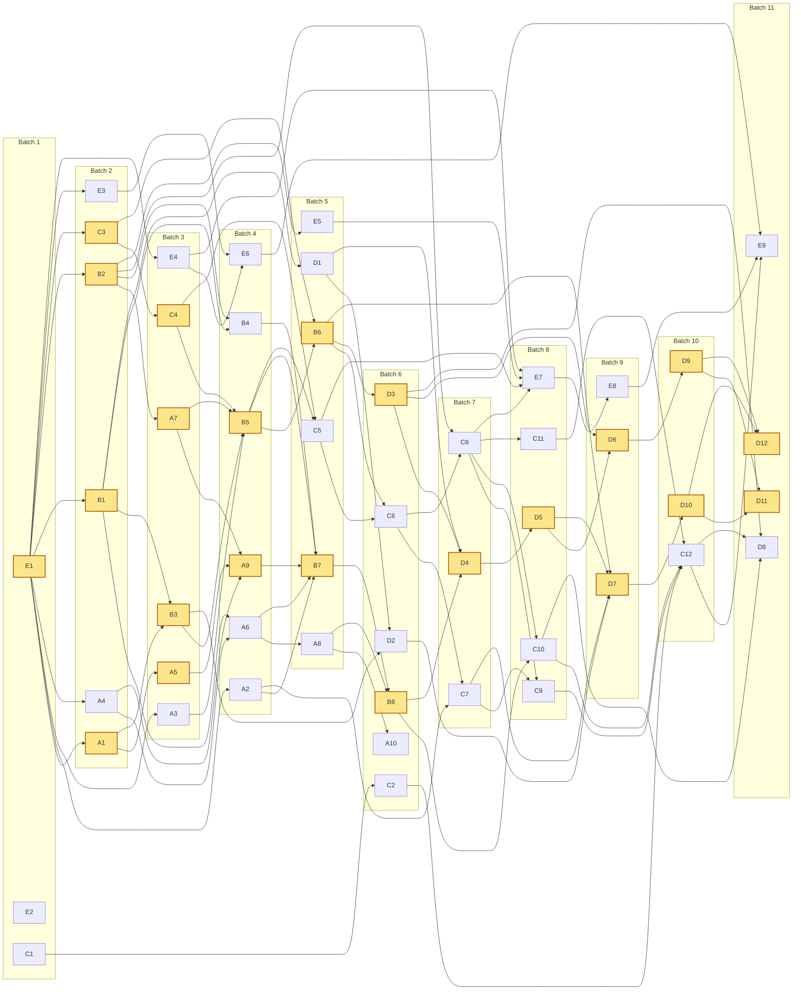

# Quark desktop skeleton: implementation plan

> **For agentic workers:** REQUIRED SUB-SKILL: Use superpowers:subagent-driven-development (recommended) or superpowers:executing-plans to implement this plan task-by-task. Steps use checkbox (`- [ ]`) syntax for tracking. Section 1 sets who runs which step: workers (the leaves) write code and managers review it. Section 5 sets the order: gated batches, with every worker in its own git worktree.

**Goal:** Build sub-project 1 of the Rust desktop pivot: a Tauri 2 app on macOS, Windows and Ubuntu that runs the existing Svelte UI against a new Rust backend core. This first slice covers projects, upload, paging, filter, sort and dedupe, plus four efficiency upgrades, a parity harness built on the existing pytest suite, and CI that builds installers.

**Architecture:**
- `crates/quark-core` is the backend: DuckDB engines, the query builder, Arrow encoding, caches, and an axum router.
- `src-tauri` is a thin shell. It binds the router to `127.0.0.1` behind CORS, Host and token guards, and opens a window whose page learns the port and token from an initialization script.
- The Python backend stays untouched as the reference. Its pytest suite runs against `quark-dev-server` to prove parity.

**Tech stack:** Rust 1.97.1 (edition 2024); `duckdb` crate `=1.10504.0` (DuckDB 1.5.4, bundled); Arrow IPC; axum 0.8; tokio; tower-http; Tauri 2.12; Svelte 5 and TypeScript (one small transport change); pytest and httpx (existing); GitHub Actions.

**Spec:** `docs/plans/2026-10-02-rust-desktop-skeleton-design.md`. Managers read it. Workers get everything they need through their unit cards. References such as "spec §5.6" point into it.

In unit cards, `core/…` means `crates/quark-core/…`.

---

## 1. Team and execution

### 1.1 Tiers

The team is a tree. Engineering happens only at the leaves. Review happens at every level above them, and each level reviews less material than the one below it.

| Tier | Role | Count | Owns | Reads | Reviews |
|---|---|---|---|---|---|
| L0 | Lead | 1 (a fresh main session, section 1.10) | Batch order and batch gates, the run log, escalations, human checkpoints, the exit gate | Review-group reports, batch gate output, sprint reports | Batch gates |
| L1 | Sprint manager (SM) | 6, one per sprint, spawned at the sprint's end | The sprint gate: push, CI, an audit of the sprint's hot spots | The sprint's review-group reports, CI results, the hot spots listed in section 6 | The task managers' work for its sprint; any unit marked **direct** |
| L2 | Task manager (TM) | 18, one per review group | One review group (3 units or fewer) within one batch: worktrees, reviews, integration | Unit reports and unit diffs (about 150 lines each) | Every unit diff in its group, line by line |
| L3 | Worker | 50 planned, plus fix units | Exactly one unit card, inside its own worktree | Its card, section 2, the signatures of the units it needs | Its own tests |

A review group holds the 3 or fewer units of one batch that a single task manager reviews. Groups follow streams where they can. A unit with no group is marked **direct** and is reviewed by its sprint manager. C12 is not a worker unit: its task manager runs the parity loop and spawns fix workers.

```mermaid
flowchart TD
  L["Lead (main session)"]
  L --> S1["SM · Sprint 1"] & S2["SM · Sprint 2"] & S3["SM · Sprint 3"] & S4["SM · Sprint 4"] & S5["SM · Sprint 5"] & S6["SM · Sprint 6"] & X["Exit reviewers (3)"]
  S1 --> g11["TM · b1: E1 E2 C1"] & g21["TM · b2: A1 A4 C3"] & g22["TM · b2: B1 B2 E3"]
  S2 --> g31["TM · b3: A3 A5 A7"] & g32["TM · b3: B3 C4 E4"] & g41["TM · b4: A2 A6 A9"] & g42["TM · b4: B4 B5 E6"]
  S3 --> g51["TM · b5: B6 B7 C5"] & g52["TM · b5: A8 D1 E5"] & g61["TM · b6: B8 D2 D3"] & g62["TM · b6: A10 C2 C6"]
  S4 --> g71["TM · b7: C7 C8 D4"] & g81["TM · b8: C9 C10 C11"] & g82["TM · b8: D5 E7"]
  S5 --> g91["TM · b9: D6 D7 E8"] & g101["TM · b10: D9 D10"] & g102["TM · b10: C12 parity loop"]
  S6 --> g111["TM · b11: D8 D11 D12"] & s6d["direct · b11: E9"]
```



Every unit ID shown is one worker leaf. C12 is the exception: its leaves are the fix workers the loop spawns.

### 1.2 Streams

Units belong to five streams. Each stream owns a set of files, so units in the same batch never collide. Unit IDs are stable; the batch decides when a unit runs.

| Stream | Owns | Units |
|---|---|---|
| A: SQL text and values | `sql.rs`, `naming.rs`, `literal.rs`, `ids.rs`, `values.rs`, `query.rs` | A1–A10 |
| B: Engines and pages | `error.rs`, `engine.rs`, `mount.rs`, `guard.rs`, `page.rs`, `arrow.rs` | B1–B8 |
| C: State, API and parity | `registry.rs`, `state.rs`, `api/*`, `bin/quark-dev-server.rs`, `tests/*.py`, `pyproject.toml` | C1–C12 |
| D: Caches and cancellation | `cache/*`, `cancel.rs`, plus the scheduled edits named in its cards | D1–D12 |
| E: Desktop, frontend and CI | the workspace root, `src-tauri/*`, `secure.rs`, `frontend/*`, `.github/workflows/ci.yml` | E1–E9 |

### 1.3 Gated batches

- **Batches.** The plan runs as 11 batches in a fixed order (section 5). A batch is one gated run with at most 6 workers and at most 2 task managers. Each run also has one extra slot, used for either a change-round fixer or a re-review. That keeps every run at 9 agents or fewer, under the Workflow guideline of fewer than 10. Any further change rounds go into a follow-up run of the same batch.
- **What a batch may contain.** A batch holds only units whose **Needs** were all integrated by earlier batches. Units in the same batch never depend on each other, and they never edit the same file. The one exception is purely additive edits to shared registration points: dependency lines in `Cargo.toml` files, `mod` lines in `core/src/lib.rs`, `cache/mod.rs` and `api/mod.rs`, and route registrations. When those collide, the integrator keeps both lines. Section 5 has been checked against both rules.
- **Batch lifecycle:**
  1. The task managers create worktrees and assign their units. Workers run in parallel.
  2. Each task manager reviews its group and integrates the units it approves (section 1.6).
  3. The Lead runs the batch gate (section 1.6). The next batch starts only after the gate passes.
- **Sprint gates.** Every second batch closes a sprint. The Lead then spawns that sprint's manager, which pushes, watches CI and audits the sprint. The next batch may start while CI runs, but CI must be green before the batch after that starts: a one-batch lag. If CI fails, the Lead opens a fix batch before going on.
- **Units add what they use.** A unit adds every dependency it uses, even if another unit in the same batch adds the same one.

### 1.4 Engineering role (workers)

A worker receives one unit card, section 2, the interface signatures of the units in its **Needs** (pasted in by its task manager), and the path of its own worktree. It does not receive the spec or the rest of this plan.

- [ ] Work only inside your worktree (section 1.6).
- [ ] Write the card's tests first. Run them and confirm they fail for the reason the card describes.
- [ ] Implement the smallest code that makes them pass.
- [ ] Run the card's **Done when** command. For Rust units, also run `cargo fmt --all` and `cargo clippy -p <crate> -- -D warnings`; for other units, the listed npm or uv commands.
- [ ] Commit once, with the card's commit subject and the footer from section 2.
- [ ] Send a unit report (section 1.7).

Rules for workers:

- **Scope:** touch only the files the card lists. The budget is 3 files or fewer and about 150 changed lines including tests, unless the card says otherwise. If a unit needs more than 200 lines, stop and report `needs split` with the reason.
- **Code:** add only the dependencies the card names. No speculative code, no TODOs, no commented-out code.
- **Rust units:** follow the Rust rules digest in section 2. Don't load the whole `rust-skills` skill (about 9.5k tokens). If a digest line isn't enough, open just that rule's file, `/Users/mali/Development/quark/.claude/skills/rust-skills/rules/<id>.md`.
- **Context:** stay within your budget (section 1.10).
  - Read only the files your card names. In large files, find what you need with `rg -n` and read just those line ranges.
  - Never read these in full: `tests/test_backend.py`, `frontend/src/App.svelte`, `backend/app.py`, this plan, or the spec.
  - Prefix shell commands with `rtk`.
- **Git:** never push. Never switch branches. Never touch another worktree or the main checkout. Stage explicit paths only.

### 1.5 Review role (managers)

**Task manager, for each unit in its group:**
- [ ] Prepare the worktree (section 1.6) and send the assignment (section 1.7).
- [ ] When the report arrives, re-run the card's **Done when** command yourself. Do not trust the report.
- [ ] Trace every **Build** bullet to code, and every **Tests first** bullet to a test that asserts it.
- [ ] Mutation spot check: break one asserted behavior, confirm a test fails, then revert.
- [ ] Check scope and budget: only the card's files, within budget, no unrelated edits.
- [ ] Check section 2: no `unwrap()` outside tests, no lock held across `.await`, no DuckDB call on the async runtime, error texts exactly as specified, no unlisted dependencies.
- [ ] Send a verdict. Changes go back to the same worker when the runtime can resume it. Otherwise send them to one fresh fixer, which gets the worktree, the diff and the findings. After two change rounds, split the unit or escalate to the Lead.
- [ ] Integrate each approved unit (section 1.6). When the group is done, check that its units fit together (no duplicate helpers, consistent names), run the group gate from section 6, and send a review-group report to the Lead.

**Sprint manager, spawned at the sprint's end:**
- [ ] Push `rust-desktop/skeleton` and watch CI.
- [ ] Read the sprint's review-group reports and audit the sprint's hot spots (section 6) in the code. Use targeted reads, not the whole diff.
- [ ] Review any **direct** unit the same way a task manager would.
- [ ] Send a sprint report (section 1.7) to the Lead.

**Lead:**
- Spawns task managers per batch and sprint managers per sprint.
- Runs batch gates and keeps the run log.
- Decides escalations, runs the human checkpoints, and owns the exit gate.

### 1.6 Worktrees and integration

Every worker gets its own git worktree, so parallel work never shares a working tree, an index or build output.

**Pre-flight (Lead, once):**
- [ ] The main checkout (`/Users/mali/Development/quark`) stays on `rust-desktop/skeleton`, and each integration fast-forwards it, so the human sees every unit land. During the run, the human neither commits on this branch nor edits files the plan touches. The existing uncommitted change to `AggregateMenuPopover.svelte` is fine, because no unit touches that file.
- [ ] Run `git config gc.auto 0`, so an automatic gc never races parallel git commands. At the exit gate, restore it with `git config --unset gc.auto`.
- [ ] Create `/Users/mali/Development/quark-wt/` and the gate worktree, on a detached HEAD so it never holds the branch: `git worktree add --detach /Users/mali/Development/quark-wt/gate rust-desktop/skeleton`.
- [ ] Start the run log at `/Users/mali/Development/quark-wt/runlog.md`. It is outside the repository and never committed, and a new Lead session can resume from it.
- [ ] Check the tools: `rustc 1.97.1`, `uv`, Node 22, `npx`.

**Warm caches (Lead, at each batch gate):**
- The gate worktree builds what later worktrees copy: `cargo build -p quark-core` (and `-p quark` once E4 exists) into `gate/target`, `npm ci` into `gate/frontend/node_modules`, and `uv sync --frozen`.
- DuckDB's C++ is compiled once here, starting with the batch 2 gate.

**Per unit (its task manager, before assigning it):**
```
wt=/Users/mali/Development/quark-wt/<unit>
git worktree add -b rust-desktop/skeleton-<unit> "$wt" rust-desktop/skeleton
cp -cR /Users/mali/Development/quark-wt/gate/target "$wt/target"
cp -cR /Users/mali/Development/quark-wt/gate/frontend/node_modules "$wt/frontend/node_modules"   # frontend or src-tauri units only
(cd "$wt" && uv sync --frozen)                                                                   # units that run pytest only
```

`cp -c` is an APFS copy-on-write clone. It is near-instant and shares disk blocks, so no worktree recompiles DuckDB and only the crates a unit changes take new space. Before the batch 2 gate there is nothing to clone, so skip those lines.

**Integration (task manager, after approving a unit):**
```
git -C "$wt" rebase rust-desktop/skeleton          # additive conflicts: keep both lines
(cd "$wt" && <the unit's Done when command>)
git -C /Users/mali/Development/quark merge --ff-only rust-desktop/skeleton-<unit>
```

A `--ff-only` merge succeeds only if the branch hasn't moved since the rebase. If another task manager integrated first, it refuses; repeat from the rebase. It also refuses when the human has uncommitted edits in a file the unit changes; report that to the Lead instead of forcing it. Afterwards, run `git worktree remove "$wt"` and `git branch -D rust-desktop/skeleton-<unit>`.

**Batch gate (Lead):**
- [ ] Every unit in the batch is approved and integrated.
- [ ] In the gate worktree, run `git checkout --detach rust-desktop/skeleton`, then the batch gate commands from section 6.
- [ ] Add one line to the run log: batch, base sha, commands, results.
- [ ] If the gate is red, open a fix batch (one fix unit per failure cluster, 5 at most) and re-run the gate.
- [ ] If the batch closes a sprint, spawn that sprint's manager.

**Safety rules:**
- Only sprint managers push, only `rust-desktop/skeleton`, and only at sprint gates. Nothing is merged into `rust-desktop/integration` or `main`, and no pull requests are opened.
- Worktree creation and removal can run concurrently. Fast-forward merges into the main checkout are serialized by git's index lock. If a git command fails on a `.lock` file, wait 2 s and retry; never delete lock files by hand.
- Never stage or modify the user's work in progress: `frontend/src/components/organisms/AggregateMenuPopover.svelte`, `.agents/`, `.claude/skills/rust-skills`, `.hermes/`, `.pi/`, `skills-lock.json`.

### 1.7 Message templates

**Assignment** (task manager to worker):
```
You are a worker. Implement exactly one unit, test-first, then stop.
Unit card: <paste the card>
Global constraints: <paste section 2>
Interfaces you may use: <paste the signatures from the units under Needs>
Worktree: /Users/mali/Development/quark-wt/<unit> (branch rust-desktop/skeleton-<unit>). Work only there.
Your card is complete: do not read the plan or the spec. Context budget: target 60k tokens, hard stop 100k (section 2).
Reply with a unit report. If the unit needs more than 200 changed lines, stop and reply "needs split: <reason>".
```

**Unit report** (worker to task manager, 15 lines or fewer):
```
Unit: A9 Filter, sort and dedupe builder
Commit: <sha> <subject>
Files: core/src/query.rs (+142 -0)
Tests: builder_without_filters, builder_or_connector, builder_folds_left, builder_in_between_dedupe_sorts, builder_validation_messages
Commands: cargo test -p quark-core query:: -> 9 passed; clippy clean; fmt clean
Deviations: none
Questions: none
```

**Verdict** (task manager to worker):
```
Verdict: APPROVE | CHANGES
1. [blocking] core/src/query.rs:88 IN display joins values with "," but the card requires ", ". Expected "cat" IN ('a', 'b').
```

**Review-group report** (task manager to Lead, 25 lines or fewer):
```
Group: b4·g1 (A2 A6 A9): all integrated
Units: A2 (1 round), A6 (1), A9 (2 rounds, connector fold)
Base after: rust-desktop/skeleton @ <sha>
Group gate: cargo test -p quark-core naming:: values:: query:: -> 41 passed; clippy and fmt clean
Spec trace: §5.6 -> query.rs build_query + 5 tests; §5.7 -> values.rs scalar rules + 5 tests
Hot spots checked: Unicode stem, 2^53 boundary, connector folding
Deviations or risks: none
```

**Run log line** (Lead):
```
b4 | base 3f2a91c | cargo test -p quark-core: 112 passed | clippy clean | gate GREEN | next: b5
```

**Sprint report** (sprint manager to Lead, 40 lines or fewer): the batches and groups with their verdicts, the CI run URL and per-job status, the hot-spot audit findings, timings worth keeping, deviations and escalations.

### 1.8 Escalation and human checkpoints

**Escalation path:**
- **Worker to task manager:** blocked, card ambiguous, `needs split`.
- **Task manager to Lead:** an interface change that affects another stream; a failure in another group's code; more than two extra units.
- **Sprint manager to Lead:** CI failures; audit findings.
- **Lead to human:** every spec deviation and every spec §11 fallback.

**Human checkpoints:**
- **H1** (after batch 9, recommended, not blocking): a human runs `cargo tauri dev` on macOS and clicks through creating a project, uploading a CSV, scrolling, filtering and recording a Version.
- **H2** (exit gate, required): a human runs the spec §8.5 smoke test with the CI installers on macOS, Windows and Ubuntu.

### 1.9 Subagents spawned

| Role | Spawned | Basis |
|---|---|---|
| Lead | 0 | The main session leads |
| Sprint managers | 6 | One per sprint |
| Task managers | 18 | One per review group: 1+2 / 2+2 / 2+2 / 1+2 / 1+2 / 1 |
| Workers, planned | 50 | One per unit (51 units, minus C12) |
| Parity fix workers | 3–8 (estimate) | One per failure cluster found by C12 |
| Split workers | 0–3 (estimate) | Only when a unit reports `needs split` |
| Change-round fixers | 0–10 | 0 if workers can be resumed; a fresh fixer per change round if batches run as Workflow scripts |
| Exit reviewers | 3 | Whole-branch spec conformance, with the spec split three ways to keep each context small |
| **Total** | **80–98** | 77 fixed + 3–21 variable |

**Per-run size:** at most 9 agents in any batch run, counting 6 workers, 2 task managers and 1 fixer. Across the system, at most 11 agents are alive at once, adding a sprint manager doing its gate and the Lead. Section 5.1 lists each batch's run size.

**Planning token estimate** (assumptions, accurate to about ±50%):

| Role | Count | Tokens each | Total |
|---|---|---|---|
| Workers | 50 | 60k | about 3.0M |
| Parity and split fixers | about 6 | 60k | about 0.36M |
| Change-round fixers | about 5 | 25k | about 0.13M |
| Task managers | 18 | 40k | about 0.72M |
| Sprint managers | 6 | 40k | about 0.24M |
| Lead sessions | 1–2 | 60–85k | about 0.15M |
| Exit reviewers | 3 | 50k | about 0.15M |
| **Total** | | | **about 4.8M (3.5–7M)** |

### 1.10 Context budget

Every agent's context stays at or below 10% of its 1M-token window. The target is 6%, about 60k tokens.

| Role | Fixed overhead | Work content | Peak context (estimate) | Share of 1M |
|---|---|---|---|---|
| Worker, typical unit | 15–20k | Assignment 4k, targeted reads 5–15k, build and test loops 8–20k, edits 2–4k | 35–55k | 3.5–5.5% |
| Worker, heaviest units (B7, C1, E4, E7, parity fixes) | 15–20k | More reads and test loops | 55–75k | 5.5–7.5% |
| Task manager, 3 units or fewer | 15–20k | 3 cards 4k; about 7k per unit for report, diff, re-run, mutation check and integration; group gate 3k | 45–65k | 4.5–6.5% |
| Parity task manager (C12) | 15–20k | One-line triage 2k, about 1.5k per failure cluster, reruns | 40–60k | 4–6% |
| Sprint manager | 15–20k | Reports 3k, CI summary 2k, hot-spot reads 10–15k | 35–50k | 3.5–5% |
| Exit reviewer, one of 3 | 15–20k | Spec slice 3k, targeted reads 20–30k | 40–55k | 4–5.5% |
| Lead, fresh session running one Workflow per batch | 25–35k | Plan sections 1, 5 and 6 (about 10k), about 3k per batch, sprint reports | 60–85k | 6–8.5% |

Fixed overhead means the system prompt, tool definitions, `CLAUDE.md` files and hooks. For a worker it is the largest single slice, which is why each role gets a lean agent definition (rule 1).

**Rules that keep every agent in budget:**

1. **Lean agent definitions.** Before batch 1, the Lead adds four definitions, following the existing `.claude/agents/` pattern:
   - `.claude/agents/quark-worker.md`
   - `.claude/agents/quark-task-manager.md`
   - `.claude/agents/quark-sprint-manager.md`
   - `.claude/agents/quark-exit-reviewer.md`

   Each holds its role's rules from sections 1.4–1.6 and section 2, so assignments stay short. Each allows only the tools the role needs: workers get Read, Edit, Write, Bash, Grep and Glob; managers get Read, Bash, Grep and Glob. None get MCP or web tools.
2. **No whole large files.**
   - Cards are pasted into assignments. Task managers pull a card out of this plan by line range: find it with `rg -n '^#### <ID> ·'`, then print it with `sed -n`. They never read the whole plan, which is about 26k tokens.
   - Any file longer than about 1,000 lines is read by line range only.
3. **Rust rules come from the digest** in section 2, not from the full skill (about 9.5k tokens).
4. **Command output stays compact.**
   - Prefix every command with `rtk`.
   - Pytest triage uses `-q --tb=line`; a single failure uses `--tb=short`.
   - Read CI with `gh run view <id> --json conclusion,jobs`.
5. **Hard stop at 100k.**
   - An agent that passes about 40 tool calls, or about 80k tokens of context, stops and sends a handoff: what is done, what is left, and any open question. Its manager continues with a fresh agent.
   - Change rounds resume the original worker only while it is under about 60k. Otherwise a fresh fixer gets the diff and the findings.
6. **The Lead is a fresh main session, not the planning session.** The planning session is already past 150k.
   - The Lead runs each batch as one Workflow script. The script's return value is the compact batch summary, so agent transcripts never enter the Lead's context.
   - If the Lead passes about 80k, it writes a handoff to the run log, and a new session continues from there.

---

## 2. Global Constraints

Every unit's requirements include this section.

**Process**
- **Context budget (every agent):** target 60k tokens of context, hard stop at 100k (section 1.10).
  - Past about 40 tool calls, stop and send a handoff.
  - Read only what your card or assignment names. In files longer than about 1,000 lines, use `rg -n` and read line ranges.
  - Never read these in full: `tests/test_backend.py`, `frontend/src/App.svelte`, `backend/app.py`, the plan, the spec.
  - Prefix every shell command with `rtk`.
- **Worktree:** work only inside your own worktree (section 1.6). Commit subjects follow Conventional Commits with scopes `core`, `desktop`, `ui`, `tests`, `ci` or `build`. Every commit message ends with `Co-Authored-By: Claude Opus 5.5 <noreply@anthropic.com>`.
- **Tauri CLI:** `cargo tauri <command>` (after `cargo install tauri-cli --version "^2.12" --locked`) and `npx --yes @tauri-apps/cli@^2.12 <command>`, run from the worktree root, are interchangeable. Agents and CI use `npx`.

**Toolchain and build**
- **Toolchain:** `rust-toolchain.toml` pins `1.97.1` with `rustfmt` and `clippy`. Workspace edition `2024`, `rust-version = "1.97"`, resolver `"3"`.
- **Lints:** set at workspace level.
  - `unsafe_code = "deny"`.
  - Clippy: `correctness` deny; `suspicious`, `style`, `complexity` and `perf` warn; `unwrap_used` deny; `expect_used` warn; `dbg_macro` and `todo` deny.
  - Tests may unwrap (`clippy.toml`). CI runs clippy with `-D warnings`.
- **DuckDB:** `duckdb = { version = "=1.10504.0", features = ["bundled", "parquet", "json"] }`. The engine must report `v1.5.4`, the version in `uv.lock`. `libduckdb-sys` builds at `opt-level = 3` even in dev.

**Errors**

User-facing failures are `ApiError`, rendered as `{"detail": "<text>"}`. The exact texts are:

| Status | Detail |
|---|---|
| 501 | "Not in the desktop build yet" |
| 400 | "Unsupported file type", "Could not open source: <err>" |
| 404 | "Project not found", "Source not found", "Node not found", "Dataset not found" |
| 422 | "Project name is required", "Invalid filter column or operator", "Filter value is required", "IN filter requires a non-empty list", "BETWEEN filter requires two bounds", "Text operator requires a text column", "Invalid dedupe column", "Invalid sort column", "SQL accepts only one read-only SELECT query", "Invalid SQL query: <err>", "Invalid filter value: <err>" |
| 401 | "Unauthorized" |
| 403 | "Forbidden host" |
| 500 | "Internal error" |

**Runtime behavior**
- **Concurrency:** no lock is held across `.await`. All DuckDB work runs in `spawn_blocking`. Every `std::sync::Mutex` is locked through a helper that recovers from poisoning.
- **Paging:** `page >= 1`, `1 <= page_size <= 1000`, defaults page 1 and page size 100.
- **Arrow:** media type `application/vnd.apache.arrow.stream`, schema metadata key `quark`, header `Vary: Accept`.
- **Caches:**
  - count and null cache: 256 entries per engine;
  - result cache: 4 per engine, with 1 build in flight;
  - columnar cap: 10 GB;
  - folders: `<cache>/columnar/` and `<cache>/duckdb-tmp/`.

**Security**
- Bind `127.0.0.1:0`. The token is 32 random bytes written as 64 lowercase hex characters.
- CORS origins are exactly `tauri://localhost` and `http://tauri.localhost`, plus `http://localhost:5173` in debug builds.
- The Host header must equal `127.0.0.1:<port>`. Preflight max-age is 86400.
- CSP, verbatim: `default-src 'self'; connect-src 'self' http://127.0.0.1:*; img-src 'self' data: blob:; font-src 'self' data:; style-src 'self' 'unsafe-inline'`.

**App**
- Identifier `ml.splitwire.quark`, product name `Quark`, version `0.1.0`.
- Window 1440×900, with a 1024×680 minimum.
- Targets: macOS 12.0 universal; Windows NSIS and MSI; Ubuntu `.deb` built on 22.04.

**Environment and logging**
- **Environment variables:** `QUARK_DATA_DIR`, `QUARK_TEST_BACKEND=rust`, `QUARK_DEV_SERVER`, `QUARK_SELF_TEST=1`.
- **Logging:** `tracing`. Never log row values or the token; log SQL text only at debug level.

**Never**
- No `panic = "abort"`.
- No new frontend dependencies.
- No Python dependency changes.

**Rust rules digest** (from `rust-skills`; rule ids in brackets)
- **Errors:**
  - Use the typed `ApiError` (thiserror) for anything a user can see [err-thiserror-lib].
  - Use `anyhow` with `.context(...)` only for startup and internal plumbing [err-anyhow-app, err-context-chain].
  - Propagate with `?`. No `unwrap()` outside tests. Use `expect()` only for real invariants, with a message saying why [err-no-unwrap-prod, err-expect-bugs-only].
- **Borrowing:** take `&str`, `&[T]` and `&Path`; clone only when you need ownership [own-borrow-over-clone, own-slice-over-vec].
- **Async:** never hold a lock across `.await`. DuckDB and file-heavy work go in `spawn_blocking` [async-no-lock-await, async-spawn-blocking].
- **Types:** use enums, not strings, for closed sets. Parse at the boundary with serde (`deny_unknown_fields`, lowercase renames) [type-no-stringly, api-parse-dont-validate, serde-deny-unknown-fields].
- **Hot paths** (cell conversion, Arrow encoding):
  - No `format!` per cell when writing into an existing buffer works [anti-format-hot-path].
  - Use `with_capacity` when the size is known [mem-with-capacity].
  - Prefer iterators to indexing [perf-iter-over-index].
- **Visibility:** `pub(crate)` for internals; `pub` only for what other modules or crates use [proj-pub-crate-internal].
- **Tests:**
  - Unit tests go in `#[cfg(test)] mod tests` with `use super::*` [test-cfg-test-module].
  - Integration tests go in `crates/quark-core/tests/` [test-integration-dir].
  - Test names describe the behavior [test-descriptive-names].
- **Logging:** `tracing` with structured fields. Never log row values, file contents or the token [obs-tracing-over-log, obs-structured-fields, obs-no-sensitive-data].
- **Naming:**
  - Treat acronyms as words: `ApiError`, `SqlQueryRequest` [name-acronym-word].
  - Booleans start with `is_` or `has_` [name-is-has-bool].

## 3. Review Focus

These are the failure modes the spec implies but no ported test covers, most likely to hurt a real user first. Each line names the test that pins it and the unit that owns that test.

1. **Paths with spaces, apostrophes and non-ASCII letters.** `it's a dir/Zoë data/Zoë's claims (v1).csv` must upload, mount and query on every OS. Test: `paths_with_quotes_spaces_and_unicode` (B5), which CI runs on all three OSes.
2. **A panic while an engine lock is held** must not wedge later requests. Tests: `poisoned_engine_lock_recovers` (B5) and `panic_does_not_wedge_the_engine` (C10).
3. **Deleting a source on Windows while DuckDB still has the file open** (a node engine, a workspace, or the columnar cache) must succeed and remove the file. Tests: `delete_releases_and_removes_file` (C7) and `deleting_source_removes_cache_files` (D10), both on `windows-latest`.
4. **Empty and header-only files, and pages past the end,** must give zero rows, `total_pages` 0, `null_fraction` 0.0, and a schema-only Arrow stream. Tests: `header_only_csv_is_an_empty_page` (B7) and `empty_page_is_schema_only` (B8).
5. **Machines not on UTC, including across DST,** must show TIMESTAMPTZ values in local time with the right offset. CI runs on UTC and would hide a bug here. Tests: `timestamptz_uses_given_zone` and `timestamptz_crosses_dst` (A8).

## 4. File structure

```
Cargo.toml, rust-toolchain.toml, clippy.toml, .gitignore      E   workspace, toolchain, lints, release profile
crates/quark-core/src/
  lib.rs                                                      all module list (additive)
  error.rs                                                    B   ApiError, ApiResult
  sql.rs  naming.rs  literal.rs  ids.rs  values.rs  query.rs  A   quoting, naming, literals, ids, values, requests and builder
  engine.rs  mount.rs  guard.rs  page.rs  arrow.rs            B   engines, mounting, SQL guard, pages, Arrow
  registry.rs  state.rs  api/{mod,read,sources,query}.rs      C   registry files, app state, HTTP routes
  bin/quark-dev-server.rs                                     C   dev and test server
  cache/{mod,stats,results,columnar}.rs  cancel.rs            D   caches, cancellation
  secure.rs                                                   E   CORS, Host and token guards
crates/quark-core/tests/
  engine_version.rs                                           B
  dev_server.rs                                               C
  cancellation.rs  cache_property.rs  perf_acceptance.rs      D
src-tauri/{Cargo.toml,build.rs,tauri.conf.json,icons/,src/{main,lib,self_test}.rs}                E
frontend/src/lib/api-transport.ts, frontend/src/lib/api.ts, frontend/src/vite-env.d.ts,
frontend/tests/api-transport.test.js, frontend/package.json                                       E
tests/backend_client.py, tests/conftest.py, tests/test_backend.py, pyproject.toml                  C
.github/workflows/ci.yml                                                                           E
```

## 5. Schedule

### 5.1 Batches

Batches run in order, each behind a gate. **Bold** units are on the critical path, with zero slack. "Run" counts the workers and task managers spawned for that batch's run.

| Batch | Sprint | Units | Review groups (TM) | Workers | Run |
|---|---|---|---|---|---|
| 1 | S1 | **E1**, E2, C1 | g1: E1 E2 C1 | 3 | 4 |
| 2 | S1 | **A1**, A4, **B1**, **B2**, **C3**, E3 | g1: A1 A4 C3 · g2: B1 B2 E3 | 6 | 8 |
| 3 | S2 | A3, **A5**, **A7**, **B3**, **C4**, E4 | g1: A3 A5 A7 · g2: B3 C4 E4 | 6 | 8 |
| 4 | S2 | A2, A6, **A9**, B4, **B5**, E6 | g1: A2 A6 A9 · g2: B4 B5 E6 | 6 | 8 |
| 5 | S3 | A8, **B6**, **B7**, C5, D1, E5 | g1: B6 B7 C5 · g2: A8 D1 E5 | 6 | 8 |
| 6 | S3 | A10, **B8**, C2, C6, D2, **D3** | g1: B8 D2 D3 · g2: A10 C2 C6 | 6 | 8 |
| 7 | S4 | C7, C8, **D4** | g1: C7 C8 D4 | 3 | 4 |
| 8 | S4 | C9, C10, C11, **D5**, E7 | g1: C9 C10 C11 · g2: D5 E7 | 5 | 7 |
| 9 | S5 | **D6**, **D7**, E8 | g1: D6 D7 E8 | 3 | 4 |
| 10 | S5 | **D9**, **D10**, then C12 | g1: D9 D10 · g2: C12 parity loop | 2 + fixes | 4 + up to 5 fixers |
| 11 | S6 | D8, **D11**, **D12**, E9 | g1: D8 D11 D12 · E9 direct (SM6) | 4 | 5 |
| Exit | S6 | Section 12 | | | |

**Result:**
- Eleven gated batches plus the exit gate, which equals the critical path. Smaller batches could not finish sooner.
- No batch exceeds 6 workers.
- The first version of this plan, with sequential sprints, had a critical path of about 38 steps.
- E3 (CI on three OSes) and E4 plus E6 (installers) are deliberately early. They retire the DuckDB-build and packaging risks by the sprint 1 and sprint 2 gates.

### 5.2 Dependency graph

Arrows run from a unit to the units that need it. Highlighted units are on the critical path.



### 5.3 Sprints

Each sprint covers two batches. The sprint manager runs its gate, and that gate's CI must be green before the batch after next starts.

| Sprint | Batches | Units | Sprint gate (sprint manager) |
|---|---|---|---|
| S1 | 1–2 | 9 | Push; CI green on all 3 OSes, which retires the DuckDB-build risk. Report the cold build minutes and B1's arrow version. |
| S2 | 3–4 | 12 | Push; CI green. Dispatch the bundle job with `gh workflow run ci.yml --ref rust-desktop/skeleton`; installers must build on all 3 OSes, which retires the packaging risk. If the universal macOS build fails or runs past 60 minutes, the Lead may approve spec §11's fallback: separate arm64 and x64 builds. |
| S3 | 5–6 | 12 | Push; CI green |
| S4 | 7–8 | 8 | Push; CI green |
| S5 | 9–10 | 5 + C12 | Push; CI green; offer H1 |
| S6 | 11 | 4 | E9 review, then section 12 |

---

## 6. Batch plan

Each batch lists its review groups, the hot spots its task manager and sprint manager must check, and the batch gate the Lead runs in the gate worktree.

### Batch 1 (sprint 1)
- **g1: E1, E2, C1.** Hot spots:
  - the `libduckdb-sys` profile override;
  - the lint table;
  - existing headers kept, and no `Content-Type` forced on `FormData`;
  - no test assertion edited;
  - the Windows `.exe` path and server teardown in the pytest switch.

  Group gate: `cargo build -p quark-core && cargo clippy -p quark-core -- -D warnings && (cd frontend && npm test && npm run check && npm run build) && uv run pytest -q`.
- **Batch gate:** the group gate, run again on the integrated base.

### Batch 2 (sprint 1)
- **g1: A1, A4, C3.** Hot spots: the extension table, the classification table, tolerance of malformed files. Group gate: `cargo test -p quark-core sql:: values:: registry::`.
- **g2: B1, B2, E3.** Hot spots: parsing `uv.lock`, the error body shape, CI triggers and `--locked`. Group gate: `cargo test -p quark-core`.
- **Batch gate:**
  1. `cargo test -p quark-core`, clippy and fmt.
  2. Warm `gate/target`. DuckDB compiles here once.
  3. Spawn SM1.

### Batch 3 (sprint 2)
- **g1: A3, A5, A7.** Hot spots: surrogate pairs; float exponent format; `deny_unknown_fields` without `flatten`. Group gate: `cargo test -p quark-core ids:: literal:: query::`.
- **g2: B3, C4, E4.** Hot spots:
  - lockdown order (spill, then lock);
  - raw registry records surviving a save;
  - Tauri config: targets, CSP verbatim, no capability grants.

  Group gate: `cargo test -p quark-core engine:: registry:: && npm --prefix frontend run build && cargo clippy -p quark -- -D warnings`.
- **Batch gate:** `cargo test -p quark-core`; `cargo clippy --workspace -- -D warnings` (with the frontend built); warm `gate/frontend/node_modules`.

### Batch 4 (sprint 2)
- **g1: A2, A6, A9.** Hot spots: Unicode stems; the 2^53 boundary; connector folding and parameter order. Group gate: `cargo test -p quark-core naming:: values:: query::`.
- **g2: B4, B5, E6.** Hot spots:
  - guard messages;
  - node-engine order (spill, then mount, then lock);
  - poison recovery;
  - bundle job conditions and artifact paths.

  Group gate: `cargo test -p quark-core guard:: engine::`.
- **Batch gate:** `cargo test -p quark-core`; clippy; spawn SM2.

### Batch 5 (sprint 3)
- **g1: B6, B7, C5.** Hot spots:
  - `.wal` siblings in the allow-list;
  - idempotent mounting;
  - counting over the relation;
  - the registry is never rewritten at startup.

  Group gate: `cargo test -p quark-core mount:: page:: state::`.
- **g2: A8, D1, E5.** Hot spots:
  - microsecond formatting and DST;
  - the cache key fields;
  - guard layer order and the constant-time compare.

  Group gate: `cargo test -p quark-core values:: cache::columnar secure::`.
- **Batch gate:** `cargo test -p quark-core`; clippy.

### Batch 6 (sprint 3)
- **g1: B8, D2, D3.** Hot spots:
  - `"null"` text in fallback columns and the zero-row schema;
  - the atomic rename from `.partial`;
  - a guard interrupts only its own query.

  Group gate: `cargo test -p quark-core arrow:: page:: cache::columnar cancel::`.
- **g2: A10, C2, C6.** Hot spots:
  - nested map keys;
  - the marker lists are exact;
  - the catalog lock is never held while mounting.

  Group gate: `cargo test -p quark-core values:: state:: && uv run pytest -q`.
- **Batch gate:** `cargo test -p quark-core`; clippy; `uv run pytest -q`; spawn SM3.

### Batch 7 (sprint 4)
- **g1: C7, C8, D4.** Hot spots:
  - the Windows deletion order;
  - 501 only under `/api`;
  - the stats key excludes ORDER BY and includes parameters.

  Group gate: `cargo test -p quark-core state:: api:: cache:: page::`.
- **Batch gate:** `cargo test -p quark-core`; clippy.

### Batch 8 (sprint 4)
- **g1: C9, C10, C11.** Hot spots:
  - the body limit is disabled only on the upload routes;
  - Arrow headers;
  - the listening line is flushed.

  Group gate: `cargo test -p quark-core api:: && cargo test -p quark-core --test dev_server`.
- **g2: D5, E7.** Hot spots:
  - eviction drops tables;
  - the token is never logged and reaches JS through `serde_json`;
  - the navigation allow-list.

  Group gate: `cargo test -p quark-core cache::results && cargo build -p quark`.
- **Batch gate:** `cargo test -p quark-core`; `cargo clippy --workspace -- -D warnings`; spawn SM4.

### Batch 9 (sprint 5)
- **g1: D6, D7, E8.** Hot spots:
  - builds never take the engine lock;
  - allow-lists include ready caches;
  - a purged cache falls back to the live file;
  - the self-test sits behind the same guards.

  Group gate: `cargo test -p quark-core cache:: mount:: state::`, plus the self-test (`npx --yes @tauri-apps/cli@^2.12 build --no-bundle`, then `QUARK_SELF_TEST=1 QUARK_DATA_DIR=$(mktemp -d) ./target/release/quark; echo $?` prints `0`).
- **Batch gate:** `cargo test -p quark-core`; the self-test again; offer H1.

### Batch 10 (sprint 5)
- **g1: D9, D10.** Hot spots: insertion order is preserved; Windows deletes cache files. Group gate: `cargo test -p quark-core page:: cache::columnar state::`.
- **g2: C12, the parity loop.** It starts after g1 is integrated, with at most 5 fix workers in flight; anything beyond that goes in a follow-up fix batch. Group gate: `cargo build -p quark-core --bin quark-dev-server && QUARK_TEST_BACKEND=rust uv run pytest -m skeleton -q`.
- **Batch gate:** `cargo test -p quark-core`; the Rust-mode skeleton suite; spawn SM5.

### Batch 11 (sprint 6)
- **g1: D8, D11, D12.** Hot spots:
  - the oracle bypasses every cache;
  - sort keys are unique;
  - the hyper fallback is used only with the Lead's approval.

  Group gate: `cargo test -p quark-core --test cancellation --test cache_property`, plus the D12 performance report.
- **E9:** a direct unit; SM6 reviews it.
- **Batch gate:** `cargo test -p quark-core`; spawn SM6; then section 12.

---

## 7. Unit cards: stream A (SQL text and values)

#### A1 · Quoting and scan expressions · batch 2
- **Files:** `core/src/sql.rs` (new), `core/src/lib.rs`.
- **Needs:** E1.
- **Build:**
  - `quote_ident(name)`: wraps in `"` and doubles any inner `"`.
  - `sql_string(text)`: wraps in `'` and doubles any inner `'`.
  - `scan_expression(path: &str) -> Option<String>`, by lowercase extension:

    | Extension | Expression |
    |---|---|
    | `csv` | `read_csv_auto('<p>', delim=',')` |
    | `tsv` | `read_csv_auto('<p>', delim='\t')`, with a literal backslash-t, as Python writes it |
    | `parquet` | `read_parquet('<p>')` |
    | `json`, `ndjson`, `jsonl` | `read_json_auto('<p>')` |
    | anything else | `None` |

    `<p>` is the `sql_string` body of the path.
- **Tests first:**
  - `quote_ident_doubles_inner_quotes`
  - `sql_string_doubles_single_quotes`
  - `scan_expression_per_extension` (including `.CSV`; `.duckdb` and `.xlsx` give `None`)
  - `scan_expression_escapes_quotes_in_paths`: `/tmp/it's/x.csv` gives `read_csv_auto('/tmp/it''s/x.csv', delim=',')`
- **Done when:** `cargo test -p quark-core sql::` passes.
- **Commit:** `feat(core): add SQL quoting and scan expressions`

#### A2 · `dataset_name` and `page_count` · batch 4
- **Files:** `core/src/naming.rs` (new), `core/src/lib.rs`.
- **Needs:** E1.
- **Build:**
  - `dataset_name(filename) -> String`:
    1. Take the stem the way Python's `Path(name).stem` does: drop the last extension, but a leading-dot name such as `.csv` keeps its dot.
    2. Lowercase it with Unicode rules.
    3. Replace each run of characters outside `[a-z0-9]` with `_`, then trim `_` from both ends.
    4. If the result is empty, return `data`. If it starts with a digit, prefix `data_`.
  - `page_count(rows: u64, page_size: u64) -> u64` is ceiling division.
- **Tests first:**
  - `dataset_name_matches_python`:

    | File name | Expected |
    |---|---|
    | `Claims v1.csv` | `claims_v1` |
    | `2024 sales.csv` | `data_2024_sales` |
    | `___.csv` | `data` |
    | `.csv` | `csv` |
    | `Zoë Data.parquet` | `zo_data` |
    | `x.tsv` | `x` |
    | `ÅÄÖ.json` | `data` |

  - `page_count_rounds_up`:

    | Rows, page size | Expected |
    |---|---|
    | 0, 100 | 0 |
    | 1, 100 | 1 |
    | 100, 100 | 1 |
    | 101, 100 | 2 |
    | 9007199254740993, 1 | 9007199254740993 |

- **Done when:** `cargo test -p quark-core naming::` passes.
- **Commit:** `feat(core): port dataset naming and page counting`

#### A3 · Python-compatible ids · batch 3
- **Files:** `core/src/ids.rs` (new), `core/src/lib.rs`, `Cargo.toml`, `core/Cargo.toml` (`base64 = "0.23"`).
- **Needs:** E1.
- **Build:**
  - `python_json(value) -> String` produces compact JSON with `ensure_ascii`:
    - Every non-ASCII character becomes `\uXXXX` in lowercase hex; characters outside the BMP become surrogate pairs.
    - `\n`, `\r`, `\t`, `\b` and `\f` use their short escapes; other control characters become `\u00XX`.
    - `"` and `\` are escaped.
  - `b64(text)` is URL-safe base64 without padding.
  - `dataset_id(schema, name) = b64(python_json([schema, name]))`
  - `view_id(project_id, source_id, dataset_id)` encodes the three values the same way.
  - `source_schema(source_id, dataset_id) = "source_" + b64(python_json([source_id, dataset_id]))`
  - `database_alias(source_id) = "database_" + b64(source_id)`, over the raw string.
- **Tests first** (values from Python):

  | Call | Expected |
  |---|---|
  | `dataset_id("main","data")` | `WyJtYWluIiwiZGF0YSJd` |
  | `python_json(["main","zoë📊"])` | `["main","zoë📊"]` |
  | its dataset id | `WyJtYWluIiwiem9cdTAwZWJcdWQ4M2RcdWRjY2EiXQ` |
  | `view_id("p1","s1",dataset_id("main","data"))` | `WyJwMSIsInMxIiwiV3lKdFlXbHVJaXdpWkdGMFlTSmQiXQ` |
  | `source_schema("s1", <that id>)` | `source_WyJzMSIsIld5SnRZV2x1SWl3aVpHRjBZU0pkIl0` |
  | `database_alias("0f8e2c")` | `database_MGY4ZTJj` |

- **Done when:** `cargo test -p quark-core ids::` passes.
- **Commit:** `feat(core): generate dataset and view ids identical to Python's`

#### A4 · Type classification · batch 2
- **Files:** `core/src/values.rs` (new), `core/src/lib.rs`.
- **Needs:** E1.
- **Build:**
  - Python's prefix tuples become constants:
    - `NUMERIC`: TINYINT, SMALLINT, INTEGER, BIGINT, HUGEINT, UTINYINT, USMALLINT, UINTEGER, UBIGINT, UHUGEINT, FLOAT, REAL, DOUBLE, DECIMAL
    - `TEXT`: VARCHAR, CHAR, TEXT
    - `DATE`: DATE, TIME, TIMESTAMP
  - `is_numeric(t)` and `is_text(t)` test whether the uppercased type starts with one of the prefixes.
  - `profile_kind(t) -> Option<&'static str>` returns `"numeric"` for numeric types; `"categorical"` for text types, `ENUM…` or `BOOLEAN`; `"date"` for date types; otherwise `None`.
  - `is_native(t)` is exact uppercase membership in {BOOLEAN, TINYINT, SMALLINT, INTEGER, BIGINT, UTINYINT, USMALLINT, UINTEGER, UBIGINT, FLOAT, REAL, DOUBLE, VARCHAR, BLOB}.
- **Tests first:** `classification_matches_python`, where `profile_kind` is the kind column:

  | Type | `is_numeric` | Kind | `is_native` |
  |---|---|---|---|
  | `DECIMAL(18,3)` | yes | numeric | no |
  | `VARCHAR` | no | categorical | yes |
  | `ENUM('a', 'b')` | no | categorical | no |
  | `BOOLEAN` | no | categorical | yes |
  | `TIMESTAMP WITH TIME ZONE` | no | date | no |
  | `INTEGER[]` | no | none | no |
  | `INTERVAL` | no | none | no |
  | `BLOB` | no | none | yes |
  | `HUGEINT` | yes | numeric | no |

- **Done when:** `cargo test -p quark-core values::` passes.
- **Commit:** `feat(core): classify DuckDB types like the Python backend`

#### A5 · Python float repr and `literal` · batch 3
- **Files:** `core/src/literal.rs` (new), `core/src/lib.rs`.
- **Needs:** A1.
- **Build:**
  - `python_float_repr(x: f64) -> String` matches Python's `repr`. Take the shortest round-trip digits and the exponent from `format!("{:e}", x)`.
    - Render positionally when the exponent is between -4 and 15, with at least one fractional digit.
    - Otherwise render `<mantissa>e<sign><at least 2 digits>`.
    - Keep the sign of `-0.0`.
  - `literal(value: &serde_json::Value) -> String`:

    | Input | Output |
    |---|---|
    | null | `NULL` |
    | boolean | `TRUE` or `FALSE` |
    | integer | its digits |
    | float | `python_float_repr` |
    | string | `sql::sql_string` |
    | array or object | `sql_string` of its compact JSON |

    JSON cannot carry NaN or infinity, so there is no branch for them.
- **Tests first:**
  - `float_repr_matches_python`:

    | Input | Expected |
    |---|---|
    | 0.1 | `0.1` |
    | 1.0 | `1.0` |
    | -0.0 | `-0.0` |
    | 1e16 | `1e+16` |
    | 1e15 | `1000000000000000.0` |
    | 1.5e-05 | `1.5e-05` |
    | 0.0001 | `0.0001` |
    | 123456789.123 | `123456789.123` |
    | 1e22 | `1e+22` |
    | f64::MAX | `1.7976931348623157e+308` |
    | 5e-324 | `5e-324` |
    | 2.5 | `2.5` |
    | 100.0 | `100.0` |

  - `literal_renders_each_json_kind`: null, true, false, 42, -7, 18446744073709551615, 2.5, and `O'Brien`, which gives `'O''Brien'`.
- **Done when:** `cargo test -p quark-core literal::` passes.
- **Commit:** `feat(core): render SQL literals like the Python backend`

#### A6 · Scalar cells · batch 4
- **Files:** `core/src/values.rs`, `Cargo.toml`, `core/Cargo.toml` (`chrono = { version = "0.4", features = ["clock"] }`).
- **Needs:** A4, B1.
- **Build:** `cell_json<Tz: chrono::TimeZone>(array: &dyn Array, row: usize, type_name: &str, zone: &Tz) -> Value` dispatches on `array.data_type()`, using the arrow types `duckdb` re-exports.
  - A null slot gives `Null`. Booleans pass through.
  - Integers become a number when their absolute value is at most 2^53 - 1, otherwise a decimal string.
  - Non-finite floats give `Null`.
  - Decimal128 and Decimal256 follow the integer rule when `type_name` is `HUGEINT` or `UHUGEINT`. Otherwise they become an f64, and a non-finite result gives `Null`.
  - Utf8, LargeUtf8 and Utf8View become strings.
  - Binary types become lowercase hex.
  - A dictionary over strings (ENUM) becomes its string.
  - Data types not yet handled give `Null`; A8 and A10 add the rest.
- **Tests first** (arrays produced by `query_arrow`):
  - `big_integers_become_strings`: 9007199254740991 stays a number; ±9007199254740992 become strings; so do UBIGINT max and HUGEINT max.
  - `floats_drop_non_finite`
  - `decimals_become_floats`: 1.25 and 12.345
  - `blobs_hex_and_strings`: `from_hex('00ff')` gives `"00ff"`; a UUID, an ENUM and a JSON value give their text.
  - `null_slots_are_null`
- **Done when:** `cargo test -p quark-core values::` passes.
- **Commit:** `feat(core): convert scalar DuckDB cells to JSON`

#### A7 · Request types and `ColumnMeta` · batch 3
- **Files:** `core/src/query.rs` (new), `core/src/lib.rs`.
- **Needs:** B2.
- **Build:**
  - `pub struct ColumnMeta { pub name: String, pub type_name: String }`. B5, B7 and B8 use it.
  - Every request type uses `#[serde(deny_unknown_fields)]`:
    - `QueryRequest { page = 1, page_size = 100, filters = [], sorts = [], dedupe_columns = [] }`.
    - `SqlQueryRequest { sql, page, page_size, filters, sorts, dedupe_columns }`. Every field is written out, because serde cannot combine `flatten` with `deny_unknown_fields`. It provides `fn query(&self) -> QueryRequest`.
    - `Filter { column, operator: String, value: Option<Value>, connector: Connector }`. A JSON `null` value becomes `None`, and the connector defaults to `And`.
    - `Connector { And, Or }` and `Direction { Asc, Desc }`, both lowercase in JSON. `Sort { column, direction }`.
  - `QueryRequest::validate() -> ApiResult<()>` enforces section 2's paging bounds and returns 422 otherwise.
- **Tests first:**
  - `defaults_apply`
  - `unknown_fields_are_rejected` (both request types)
  - `paging_bounds`
  - `connector_and_direction_reject_unknown_words`
- **Done when:** `cargo test -p quark-core query::` passes.
- **Commit:** `feat(core): define query request types`

#### A8 · Temporal cells · batch 5
- **Files:** `core/src/values.rs`, `core/Cargo.toml` (dev `chrono-tz = "0.10"`).
- **Needs:** A6.
- **Build:**

  | Arrow type | JSON value |
  |---|---|
  | Date32 | `YYYY-MM-DD` |
  | Time64 | `HH:MM:SS`, then `.ffffff` only when the microseconds are non-zero |
  | Timestamp, no zone | `YYYY-MM-DDTHH:MM:SS[.ffffff]` |
  | Timestamp with zone | the same in `zone`, followed by `±HH:MM` |
  | Interval (MonthDayNano) | total seconds as a number, counting a month as 30 days |

  Sub-microsecond precision is truncated, never rounded.
- **Tests first:**
  - `dates_and_times_match_python_isoformat`:

    | SQL value | Expected |
    |---|---|
    | `DATE '2024-01-05'` | `"2024-01-05"` |
    | `TIME '10:30:00.5'` | `"10:30:00.500000"` |
    | `TIME '10:30:00'` | `"10:30:00"` |
    | `TIMESTAMP '2024-01-05 10:30:00'` | `"2024-01-05T10:30:00"` |
    | `TIMESTAMP '…10:30:00.000123'` | `"2024-01-05T10:30:00.000123"` |
    | `TIMESTAMP_NS '…10:30:00.123456789'` | `"2024-01-05T10:30:00.123456"` |

  - `timestamptz_uses_given_zone`: with a +05:30 offset, `2024-01-05 10:30:00+00` gives `"2024-01-05T16:00:00+05:30"`.
  - `timestamptz_crosses_dst` (Review Focus 5), in `America/New_York`:

    | UTC instant | Expected |
    |---|---|
    | 2024-03-10 06:59:59Z | `"2024-03-10T01:59:59-05:00"` |
    | 2024-03-10 07:00:00Z | `"2024-03-10T03:00:00-04:00"` |

  - `interval_is_total_seconds`: `1 MONTH + 2 DAY + 3 SECOND` gives 2764803.0; `'2 days'` gives 172800.0.
- **Done when:** `cargo test -p quark-core values::` passes.
- **Commit:** `feat(core): convert temporal cells with Python isoformat semantics`

#### A9 · Filter, sort and dedupe builder · batch 4
- **Files:** `core/src/query.rs`.
- **Needs:** A4, A5, A7.
- **Build:** `BuiltQuery { relation, ordered, params: Vec<Value>, display }` and `build_query(table, display_table, columns: &[ColumnMeta], request) -> ApiResult<BuiltQuery>` port Python's `filtered_relation` and `controlled_query`.
  - **Validation, per filter, in this order:**
    1. An unknown column or operator gives "Invalid filter column or operator".
    2. A missing value gives "Filter value is required", except for `is_null` and `not_null`.
    3. `in` without a non-empty array gives "IN filter requires a non-empty list".
    4. `between` without exactly two string or number bounds gives "BETWEEN filter requires two bounds".
    5. A text operator on a non-text column gives "Text operator requires a text column".
  - **Clauses**, with `c` the quoted column:

    | Operator | Clause | Display form |
    |---|---|---|
    | `is_null` / `not_null` | `c IS NULL` / `c IS NOT NULL` | same |
    | `in` | `c IN (?, ?)` | literals joined by `, ` |
    | `between` | `c BETWEEN ? AND ?` | literals |
    | `contains`, `starts_with`, `ends_with` | `<op>(c, ?)` | literal of the stringified value |
    | comparisons | `c <op> ?` | literal |

    The text operators stringify their value the way Python's `str()` would: strings as they are, numbers as their JSON text, booleans as `True` or `False`.
  - **Folding:** each clause after the first wraps everything so far as `(<so far> <AND|OR> <clause>)`, using that filter's connector.
  - **Dedupe:** duplicate or unknown keys give "Invalid dedupe column". Otherwise append ` QUALIFY row_number() OVER (PARTITION BY k1, k2) = 1`.
  - **Assembly:**
    - `relation` is `(SELECT * FROM <table><where><qualify>)`; the display relation uses the display table and the display where-clause.
    - Sorting: an unknown column gives "Invalid sort column". Otherwise the order clause is ` ORDER BY c1 ASC, c2 DESC`.
    - `ordered` is `SELECT * FROM <relation><order>`; `display` is `SELECT * FROM <display relation><order>`.
    - `params` follow clause order, with `in` and `between` expanded.
- **Tests first:**
  - `builder_without_filters`: the relation is `(SELECT * FROM "main"."x")`.
  - `builder_or_connector`:
    - relation `(SELECT * FROM "main"."x" WHERE ("price" >= ? OR contains("name", ?)))`
    - params `[100, "a"]`
    - display `… WHERE ("price" >= 100 OR contains("name", 'a'))`
  - `builder_folds_left`: three filters give `((a AND b) OR c)`.
  - `builder_in_between_dedupe_sorts`
  - `builder_validation_messages`: all seven messages.
- **Done when:** `cargo test -p quark-core query::` passes.
- **Commit:** `feat(core): port the filter, sort and dedupe builder`

#### A10 · Nested cells · batch 6
- **Files:** `core/src/values.rs`.
- **Needs:** A8.
- **Build:**
  - Lists (including fixed-size lists) become arrays. Each child converts with `type_name = ""`.
  - A struct becomes an object, with fields in order.
  - A map becomes an object whose keys are converted and then stringified (`1` becomes `"1"`).
  - Accepted gap: a HUGEINT nested inside one of these follows the decimal rule.
- **Tests first:** `lists_structs_maps`:

  | SQL value | Expected |
  |---|---|
  | `[1, NULL]` | `[1,null]` |
  | `{'x': 1}` | `{"x":1}` |
  | `MAP([1,2],['a','b'])` | `{"1":"a","2":"b"}` |
  | `[DATE '2024-01-05']` | `["2024-01-05"]` |
  | a list of structs | an array of objects |

- **Done when:** `cargo test -p quark-core values::` passes.
- **Commit:** `feat(core): convert nested cells to JSON`

## 8. Unit cards: stream B (engines and pages)

#### B1 · DuckDB dependency and engine version check · batch 2
- **Files:** `Cargo.toml`, `core/Cargo.toml`, `core/tests/engine_version.rs` (new).
- **Needs:** E1.
- **Build:** add `duckdb` to `[workspace.dependencies]` exactly as section 2 specifies, and use it from core.
- **Tests first:** `engine_matches_python_duckdb_version`:
  - Read `concat!(env!("CARGO_MANIFEST_DIR"), "/../../uv.lock")` and take the `version = "..."` line that follows `name = "duckdb"`.
  - Run `SELECT version()`, strip the leading `v`, and compare the two.
- **Done when:** `cargo test -p quark-core --test engine_version` passes. The report gives `cargo tree -p quark-core -i arrow` (the arrow version that B8 must match) and the cold build time.
- **Commit:** `build(core): pin DuckDB 1.5.4 to match the Python backend`

#### B2 · `ApiError` · batch 2
- **Files:** `core/src/error.rs` (new), `core/src/lib.rs`, `Cargo.toml`, `core/Cargo.toml`.
- **Needs:** E1.
- **Build:**
  - Dependencies: `axum = "0.8"` (feature `multipart`), `serde = { version = "1", features = ["derive"] }`, `serde_json = "1"`, `thiserror = "2"`.
  - `#[derive(Debug, thiserror::Error)] #[error("{status}: {detail}")] pub struct ApiError { status, detail }`.
  - Constructors: `new(status, detail)` plus `bad_request`, `not_found`, `unprocessable`, `not_implemented`, `unauthorized`, `forbidden` and `internal`. Getters: `status()` and `detail()`.
  - `IntoResponse` produces the status with the body `{"detail": detail}`.
  - `pub type ApiResult<T> = Result<T, ApiError>`.
- **Tests first:**
  - `renders_status_and_detail_json`
  - `not_implemented_is_501`
- **Done when:** `cargo test -p quark-core error::` passes.
- **Commit:** `feat(core): add ApiError with FastAPI-shaped bodies`

#### B3 · Folders and database lockdown · batch 3
- **Files:** `core/src/engine.rs` (new), `core/src/lib.rs`.
- **Needs:** A1, B1.
- **Build:**
  - `Dirs { data, cache }` with helpers `uploads()`, `spill()` (`cache/duckdb-tmp`), `columnar()`, `projects_file()` and `registry_file()`.
  - `configure_spill(conn, dirs)` creates the spill folder, then runs `SET temp_directory = <sql_string>`.
  - `lock_down_paths(conn, &[String])` runs `SET allowed_paths = [<sql_string>, …]` as a list literal when the list is non-empty, then `SET enable_external_access = false`.
  - `lock_down_dirs` does the same with `allowed_directories`.
- **Tests first:**
  - `spill_folder_is_configured`
  - `lockdown_allows_only_listed_files`
  - `lockdown_cannot_be_undone`
- **Done when:** `cargo test -p quark-core engine::` passes.
- **Commit:** `feat(core): configure spill folders and lock DuckDB down`

#### B4 · SQL guard · batch 4
- **Files:** `core/src/guard.rs` (new), `core/src/lib.rs`.
- **Needs:** B1, B2.
- **Build:** `check_select(conn, sql) -> ApiResult<String>` runs `SELECT json_serialize_sql(?)` and reads the JSON result:
  - If `error` is true and `error_type` is `"parser"`, return 422 with `Invalid SQL query: Parser Error: <error_message>`.
  - If there is any other error, or the result does not hold exactly one statement, return 422 with `SQL accepts only one read-only SELECT query`.
  - Otherwise return `Ok(sql.trim())`.
- **Tests first:**
  - `guard_matches_python_cases` (create table `t` first):
    - **Accepted:** `select 1`, `select 1;`, `FROM t`, `with x as (select 1) select * from x`, `describe t`, `summarize t`, `show tables`, `values (1)`, `(select 1) union (select 2)`, `-- c\nselect 1`, `SELECT 1 AS value; -- trailing`, `SELECT 1 AS value /* trailing */`
    - **Rejected with the SELECT message:** an empty string, whitespace only, `select 1; select 2`, `drop table t`, `select 1; drop table t`, `PRAGMA version`, `explain select 1`, `pivot t on a`, `ATTACH '/tmp/items.duckdb'`, `COPY t TO '/tmp/items.csv'`, `set threads=1`, `call pragma_version()`, `UPDATE t SET a = 1`, `INSERT INTO t VALUES (1)`
  - `parse_errors_say_parser_error`: `SELEC 1`
  - `returns_trimmed_sql`
- **Done when:** `cargo test -p quark-core guard::` passes.
- **Commit:** `feat(core): allow exactly one read-only SELECT through the SQL guard`

#### B5 · Node engines, datasets and describe · batch 4
- **Files:** `core/src/engine.rs`, `Cargo.toml`, `core/Cargo.toml` (`anyhow = "1"`).
- **Needs:** A3, A7, B3, C4.
- **Build:**
  - Types:
    - `DatasetInfo { id, name, schema, kind }`, with `kind` serialized as `type`.
    - `EngineKind { Workspace { project_id, node_id }, Node { node_id } }`.
    - `Engine { kind, generation: u64, inner: Mutex<EngineInner> }` and `EngineInner { pub conn: duckdb::Connection }`. Put a `ponytail:` comment on the mutex: one query at a time per engine, with parallel reads as the upgrade path (sub-project 2).
  - `Engine::lock()` recovers from poisoning.
  - `Engine::open_node(source: &SourceRecord, dirs, generation) -> anyhow::Result<Engine>`:
    - `.duckdb` and `.db` files open read-only through `Config::default().access_mode(AccessMode::ReadOnly)`, then `configure_spill`, then `SET enable_external_access = false`.
    - Flat files use an in-memory database: `configure_spill`, then `CREATE VIEW <quote_ident(dataset_name or "data")> AS SELECT * FROM <scan_expression>`, then `lock_down_dirs([the file's parent folder])`.
    - `.xlsx` returns an error.
  - `datasets(conn) -> duckdb::Result<Vec<DatasetInfo>>` ports Python's union over `duckdb_tables()` and `duckdb_views()`: it excludes internal objects and the `information_schema` and `pg_catalog` schemas, orders by schema then name, and builds ids with `ids::dataset_id`.
  - `describe(conn, relation, params) -> duckdb::Result<Vec<ColumnMeta>>` runs `DESCRIBE SELECT * FROM <relation>`.
- **Tests first:**
  - `node_datasets_per_format`: `x.csv`, `x.tsv`, `x.json`, `x.ndjson`, `x.jsonl` and `x.parquet` each list one view `x`; a DuckDB file lists its table `items`.
  - `duckdb_sources_are_read_only`
  - `paths_with_quotes_spaces_and_unicode` (Review Focus 1)
  - `poisoned_engine_lock_recovers` (Review Focus 2)
- **Done when:** `cargo test -p quark-core engine::` passes.
- **Commit:** `feat(core): open per-source DuckDB engines`

#### B6 · Workspaces and mounting · batch 5
- **Files:** `core/src/mount.rs` (new), `core/src/engine.rs`, `core/src/lib.rs`.
- **Needs:** B5, C3.
- **Build:**
  - `ViewInfo { id, project_id, source_id, source_name, node_id, name, schema, kind, columns, sql }`, with `kind` serialized as `type`. Add `mounted: BTreeMap<String, Vec<ViewInfo>>` to `EngineInner`.
  - `Engine::open_workspace(project, sources, dirs, generation)`:
    1. Open an in-memory database and run `configure_spill`.
    2. Run `lock_down_paths` with the sorted list of source paths plus `"<path>.wal"` for each `.duckdb` or `.db` source. With no sources, skip `allowed_paths` but still disable external access.
  - `Engine::mount(&self, project, source) -> anyhow::Result<Vec<ViewInfo>>` is idempotent: a source already in `mounted` returns its views.
    - **Flat file:**
      - The dataset id is `dataset_id("main", dataset_name or "data")`, and the schema is `source_schema(source.id, dataset id)`.
      - Run `CREATE SCHEMA`, then `CREATE VIEW <schema>.<name> AS SELECT * FROM <scan>`. The view's kind is `VIEW`.
    - **DuckDB file:**
      - Run `ATTACH <sql_string> AS <quote_ident(database_alias)> (READ_ONLY)`.
      - For each table or view in that database (query `duckdb_tables()` and `duckdb_views()` filtered by the database name), create the schema and `CREATE VIEW … AS SELECT * FROM <alias>.<orig schema>.<name>`.
    - **Each view's fields:**
      - `id` is `view_id(project.id, source.id, dataset_id)`.
      - `schema` is the dataset's own schema.
      - `columns` comes from DESCRIBE.
      - `sql` is `SELECT * FROM <quoted schema>.<quoted name>`.
- **Tests first:**
  - `workspace_views_have_python_ids_and_sql`
  - `mount_is_idempotent`
  - `duckdb_sources_mount_every_table_read_only`
  - `workspace_cannot_read_unlisted_files`
- **Done when:** `cargo test -p quark-core mount:: engine::` passes.
- **Commit:** `feat(core): mount project sources into workspaces`

#### B7 · Page execution and JSON pages · batch 5
- **Files:** `core/src/page.rs` (new), `core/src/lib.rs`.
- **Needs:** A2, A6, A9, B4, B5.
- **Build:**
  - Types: `PageTarget { Dataset(String), Sql(String) }`, `Format { Json, Arrow }`, `ColumnSummary { name, type_name, numeric, profile_kind, null_fraction }` (with `type_name` serialized as `"type"`), `PageMeta { columns, page, page_size, total_rows, total_pages, elapsed_ms, sql }` and `PageBody { Json(Value), Arrow(Vec<u8>) }`.
  - `run_page(inner: &mut EngineInner, target, request, format) -> ApiResult<PageBody>`:
    - **Dataset target:**
      1. Look the dataset up by id; if it isn't there, return 404 "Dataset not found".
      2. The table is `"schema"."name"`. Describe it and build the query with it as both table and display table.
      3. The response's `sql` is the display form. Execution errors return 422 `Invalid filter value: <err>`.
    - **SQL target:**
      1. Pass the SQL through `guard::check_select`.
      2. Get the columns with `DESCRIBE SELECT * FROM query(?)`, binding the SQL. A parser error returns 422 "SQL accepts only one read-only SELECT query"; any other error returns 422 `Invalid SQL query: <err>`.
      3. Build the query with table `query(?)` and display table `(<sql>)`, and prepend the SQL to the parameters.
      4. The response's `sql` is the display form when there are filters, sorts or dedupe; otherwise it is the trimmed SQL.
      5. Execution errors return 422 `Invalid SQL query: <err>`.
    - **Execution:**
      - `total_rows`: `SELECT count(*) FROM <relation>`.
      - The page: `SELECT * FROM (<ordered>) AS result LIMIT ? OFFSET ?` through `query_arrow`.
      - Null fractions: one `SELECT avg(CASE WHEN "c" IS NULL THEN 1.0 ELSE 0.0 END), … FROM <relation>`. A `NULL` result becomes 0.0, and the query is skipped when there are no columns.
      - `total_pages` uses `naming::page_count`. `elapsed_ms` is rounded to 3 decimals.
      - A JSON body is the meta plus `rows`: objects in column order, each cell from `values::cell_json(…, &chrono::Local)`.
  - Parameters bind through a small `ToSql` adapter over `serde_json::Value`: null, bool, i64, u64, f64 and string. Arrays and objects bind as their JSON text.
- **Tests first:**
  - `pages_count_and_offsets`
  - `null_fractions_per_column`
  - `header_only_csv_is_an_empty_page` (Review Focus 4)
  - `sql_target_display_rules`
  - `invalid_value_maps_to_422`
- **Done when:** `cargo test -p quark-core page::` passes.
- **Commit:** `feat(core): execute pages with counts and null fractions`

#### B8 · Arrow pages · batch 6
- **Files:** `core/src/arrow.rs` (new), `core/src/page.rs`, `core/Cargo.toml`.
- **Needs:** A8, B7.
- **Build:**
  - Add `arrow = { version = "=<the version B1 reported>", default-features = false, features = ["ipc"] }`. Using the same version makes Cargo unify it with the `arrow` that `duckdb` already pulls in.
  - Define `ARROW_MEDIA_TYPE`.
  - `encode_page(schema, batches, columns, meta) -> ApiResult<Vec<u8>>`:
    - Native columns keep their arrays (`values::is_native`).
    - Every other column becomes UTF-8 holding one JSON text per cell, with `"null"` for nulls.
    - The schema metadata `quark` holds the meta plus `json_columns`.
    - `StreamWriter` writes the stream. With zero batches, it writes a schema-only stream built from the statement's Arrow schema.
  - `run_page` returns `PageBody::Arrow` when the format is Arrow.
- **Tests first:**
  - `arrow_page_round_trips_with_metadata`
  - `mixed_page_keeps_native_columns_native`
  - `empty_page_is_schema_only` (Review Focus 4)
- **Done when:** `cargo test -p quark-core arrow:: page::` passes.
- **Commit:** `feat(core): encode pages as Arrow with JSON-fallback columns`

## 9. Unit cards: stream C (state, API and parity)

#### C1 · Backend switch for pytest · batch 1
- **Files:** `tests/backend_client.py` (new), `tests/conftest.py` (new), `tests/test_backend.py`.
- **Needs:** none.
- **Build:**
  - `backend_client.make_client(path)` is a context manager.
    - **Python mode** (the default): `TestClient(create_app(path))`.
    - **Rust mode** (`QUARK_TEST_BACKEND=rust`):
      1. Spawn `QUARK_DEV_SERVER`. It defaults to `target/debug/quark-dev-server` (plus `.exe` on Windows), resolved from the repository root, and is called with `--data-dir <path> --cache-dir <path>/.quark-cache --port 0`.
      2. Read the `QUARK_LISTENING` line, with a 30-second timeout.
      3. Yield `httpx.Client(base_url="http://<addr>", timeout=60)`.
      4. On exit, close the client, terminate the server, and kill it after 5 seconds.
  - The `client` fixture uses `make_client(tmp_path)`. Each of the 18 inline `with TestClient(create_app(X)) as c:` becomes `with make_client(X) as c:`.
  - Edit by script, not by hand. Find the sites with `rg -n "TestClient\(create_app" tests/test_backend.py`, replace them with a short Python script, and read only the fixture region (lines 1–60). Never read the whole file; it is about 28k tokens.
  - In Rust mode, `conftest.py` skips `python_only` items in `pytest_collection_modifyitems`. Nothing else in the tests changes.
- **Tests first:** none new; the suite is the test.
- **Done when:** `uv run pytest -q` passes in full (Python mode). Rust mode is first exercised in C12.
- **Commit:** `test: run the backend suite against either Python or Rust`

#### C2 · Markers · batch 6
- **Files:** `tests/test_backend.py` (decorators only), `pyproject.toml`.
- **Needs:** C1.
- **Build:**
  - Register the markers `skeleton` and `python_only` in `[tool.pytest.ini_options] markers`.
  - Insert the decorators with a short script keyed on `def <name>(`. Never read the whole test file.
  - Mark these 22 functions `@pytest.mark.skeleton`:
    ```
    test_upload_list_datasets_delete_and_registry_restart
    test_flat_file_aliases_are_safe_and_persist_across_restart
    test_legacy_registry_without_dataset_name_keeps_data_view
    test_restart_keeps_registry_entries_when_a_source_is_temporarily_missing
    test_upload_supported_formats_and_rejects_unsupported
    test_uploaded_sql_blocks_external_files_but_queries_registered_view
    test_query_pages_repeated_filters_ordered_multisort_and_null_metadata
    test_query_filter_connectors_fold_left_to_right
    test_sql_query_pages_with_metadata_and_safe_values
    test_arrow_query_matches_json_pages_and_metadata
    test_sql_query_accepts_trailing_comments
    test_sql_query_rejects_non_select_blank_and_multiple_statements
    test_query_rejects_invalid_paging_and_metadata
    test_filter_operators_and_bound_values
    test_in_filter_single_multi_and_validation
    test_missing_nodes_and_stale_registry_are_not_active
    test_query_dedupes_filtered_multi_column_rows_and_validates_keys
    test_builder_query_returns_equivalent_executable_sql
    test_projects_persist_with_stable_workspace_ids
    test_legacy_sources_are_visible_in_default_project_without_registry_migration
    test_project_sources_are_isolated_and_base_views_execute_in_project_workspace
    test_project_workspace_invalidation_keeps_inflight_query_and_refreshes_membership
    ```
  - Mark these 12 functions `@pytest.mark.python_only`:
    ```
    test_export_and_metadata_are_serialized
    test_category_values_do_not_share_a_connection_concurrently
    test_stats_cache_reuses_profiles_and_keys_row_selection
    test_stats_cache_refreshes_changed_files_and_separates_nodes
    test_stats_cache_bypasses_volatile_and_dynamic_sql
    test_stats_cache_bypasses_stored_views_and_macros
    test_stats_cache_refreshes_rebuilt_project_workspace
    test_stats_cache_bypasses_direct_file_scans
    test_stats_cache_evicts_least_recent_profile
    test_project_source_api_layers_mount_only_the_requested_source
    test_project_sql_requests_serialize_shared_workspace
    test_visualize_scatter_returns_size_and_color_domains_over_the_whole_relation
    ```
- **Done when:** `uv run pytest -m skeleton --collect-only -q` lists exactly the 22 functions (parametrized ones expand into more items), and `uv run pytest -q` still passes.
- **Commit:** `test: mark the skeleton and Python-only backend tests`

#### C3 · Projects file · batch 2
- **Files:** `core/src/registry.rs` (new), `core/src/lib.rs`, `Cargo.toml`, `core/Cargo.toml` (`serde`, `serde_json`, dev `tempfile = "3"`).
- **Needs:** E1.
- **Build:**
  - `ProjectRecord { id, name, node_id }` with constants `DEFAULT_PROJECT_ID = "default"`, `DEFAULT_PROJECT_NAME = "Default"`, `DEFAULT_PROJECT_NODE_ID = "project_default"`, and `default_project()`.
  - `load_projects(path) -> Vec<ProjectRecord>`:
    - A missing, malformed or non-array file gives an empty list.
    - Keep only objects with string `id`, `name` and `node_id`.
    - Skip `id == "default"` and any later duplicate id.
  - `save_projects(path, &[ProjectRecord]) -> io::Result<()>` creates the parent folders, writes pretty JSON to `<file>.tmp`, then renames it into place.
- **Tests first:**
  - `missing_or_malformed_projects_file_is_empty`
  - `invalid_and_duplicate_entries_are_skipped`
  - `save_is_atomic_and_round_trips`
- **Done when:** `cargo test -p quark-core registry::` passes.
- **Commit:** `feat(core): read and write projects.json`

---

#### C4 · Registry file and `SourceRecord` · batch 3
- **Files:** `core/src/registry.rs`.
- **Needs:** C3.
- **Build:**
  - `pub type RawRecord = serde_json::Map<String, Value>`.
  - `load_registry(path) -> Vec<RawRecord>` drops entries that are not objects; a malformed file gives an empty list.
  - `save_registry` writes atomically.
  - `SourceRecord { id, name, kind, source: PathBuf, project_id: Option<String>, dataset_name: Option<String>, sheets: Option<Vec<String>> }`.
  - `SourceRecord::from_raw(&RawRecord) -> Option<Self>` requires `id`, `name`, `kind` and `source` to be strings.
  - `project()` returns `"default"` when `project_id` is absent. Legacy uploads have no `project_id` key, and their public shape depends on that absence.
- **Tests first:**
  - `non_object_entries_are_dropped`
  - `unknown_keys_survive_a_save`
  - `source_record_requires_core_fields`
  - `legacy_record_defaults`
- **Done when:** `cargo test -p quark-core registry::` passes.
- **Commit:** `feat(core): read and write registry.json without losing fields`

#### C5 · Startup and catalog · batch 5
- **Files:** `core/src/state.rs` (new), `core/src/lib.rs`, `Cargo.toml`, `core/Cargo.toml` (`tracing = "0.1"`).
- **Needs:** B5, C4.
- **Build:**
  - `AppState(Arc<Shared>)` is `Clone`. `Shared` holds `dirs`, `catalog: Mutex<Catalog>` and `next_generation: AtomicU64`.
  - `Catalog` holds:
    - `projects`, with Default first;
    - `registry: Vec<RawRecord>`;
    - `sources`, the active records in registry order;
    - `engines: HashMap<String, Arc<Engine>>`, keyed by node id.
  - `AppState::load(dirs) -> anyhow::Result<AppState>`:
    1. Create the folders it needs and empty the spill folder.
    2. Load the projects and the registry. A source is active when its file exists; nothing is opened yet.
    3. Delete files in `uploads/` that no record references (comparing canonical paths).
    4. Never write `projects.json` or `registry.json`.
  - `AppState::shutdown()` drops all engines. D6 and D7 extend it.
- **Tests first:**
  - `startup_never_rewrites_registry`
  - `missing_files_are_inactive_but_kept`
  - `orphan_uploads_are_deleted`
  - `spill_folder_is_emptied`
- **Done when:** `cargo test -p quark-core state::` passes.
- **Commit:** `feat(core): load app state without rewriting the registry`

#### C6 · Projects, sources, views and engines · batch 6
- **Files:** `core/src/state.rs`, `Cargo.toml`, `core/Cargo.toml` (`uuid = { version = "1", features = ["v4"] }`).
- **Needs:** B6, C5.
- **Build:** synchronous methods on `AppState`.
  - `projects()` returns `{id, name, node_id, source_count}` for each project.
  - `create_project(name)`:
    1. A raw name outside 1–200 Unicode scalar values returns 422.
    2. Trim it; an empty result returns 422 "Project name is required".
    3. The id is a uuid4 in hex and the node id is `project_<id>`.
    4. Save `projects.json` without Default.
  - `project_sources(project_id)` returns `{id, name}` for each source, or 404 "Project not found".
  - `source_detail(project_id, source_id)` returns `{id, name, kind, project_id, views}`, or 404 "Source not found".
  - `project_views(project_id)` returns every view of the project, mounting sources in registry order.
  - **Workspaces:**
    - Fetch or create the workspace engine under the catalog lock.
    - Mount only under the engine lock.
    - If mounting fails, drop that workspace and return 422 `Invalid filter value: <err>`. This matches Python's global DuckDB error handler.
  - `legacy_nodes()` returns `{id, name, kind, source}` for each active source whose project is `"default"`.
  - `engine_for_node(node_id) -> ApiResult<Arc<Engine>>`:
    - A project node id gives that project's workspace.
    - The id of an active default-project source gives its node engine, cached after first use.
    - Anything else returns 404 "Node not found".
  - `datasets(node_id)` returns `[{id, name, schema, type, columns}]`.
- **Tests first:**
  - `projects_list_default_first_with_counts`
  - `create_project_validation`
  - `project_isolation`
  - `engine_resolution`
- **Done when:** `cargo test -p quark-core state::` passes.
- **Commit:** `feat(core): serve projects, sources, views and engines from app state`

#### C7 · Upload registration and deletion · batch 7
- **Files:** `core/src/state.rs`.
- **Needs:** A2, C6.
- **Build:**
  - `upload_path(node_id, ext)` returns `uploads/<node_id><ext>`.
  - `register_upload(project_id: Option<&str>, node_id, original_name, path) -> ApiResult<Value>`:
    1. The project must exist; otherwise return 404.
    2. Build the raw record with keys in this order:
       - `id`;
       - `name`, the original file name without its directory;
       - `kind: "upload"`;
       - `source`, the path string;
       - `project_id`, only when one was given;
       - `dataset_name`, only for flat files, using `naming::dataset_name`.
    3. Validate the file by opening a node engine and listing its datasets. On failure, delete the file and return 400 `Could not open source: <err>`.
    4. Append the record and save the registry.
    5. Drop the project's workspace engine. Keep the node engine only for default-project sources.
    6. Return `{id, name, kind, project_id}` for a scoped upload, or `{id, name, kind, source}` otherwise.
  - `delete_source(project_id, node_id)`:
    1. Return 404 if the project is unknown, the source is not active, or it belongs to another project.
    2. Drop the node engine and the project's workspace before touching the file.
    3. If the source is an upload, delete its file. Retry once after 100 ms; if that also fails, log it and leave the file for the next startup cleanup.
    4. Remove the record and save the registry.
- **Tests first:**
  - `upload_registers_and_lists`
  - `unreadable_upload_is_rejected_and_removed`
  - `delete_releases_and_removes_file` (Review Focus 3; runs on Windows in CI)
  - `delete_rules`
- **Done when:** `cargo test -p quark-core state::` passes.
- **Commit:** `feat(core): register uploads and delete sources safely on every OS`

#### C8 · Router and read routes · batch 7
- **Files:** `core/src/api/mod.rs` (new), `core/src/api/read.rs` (new), `core/src/lib.rs`, `Cargo.toml`, `core/Cargo.toml`.
- **Needs:** B2, C6.
- **Build:**
  - Dependencies: `tokio` (features `rt-multi-thread`, `macros`, `net`, `fs`, `io-util`, `signal`), `tower = { version = "0.5", features = ["util"] }`, `tower-http = { version = "0.7", features = ["catch-panic", "cors"] }` (fall back to the newest 0.6 if 0.7 does not match axum 0.8's `http`), and dev-dependency `http-body-util = "0.1"`.
  - `router(state) -> Router` serves:
    - `GET` and `POST /api/projects` (POST returns 201)
    - `GET /api/projects/{project_id}/sources`
    - `GET /api/projects/{project_id}/sources/{source_id}`
    - `GET /api/projects/{project_id}/views`
    - `GET /api/nodes`
    - `GET /api/nodes/{node_id}/datasets`
  - Fallback: any other `/api/*` path returns 501 "Not in the desktop build yet"; everything else returns 404.
  - `CatchPanicLayer::custom` turns panics into 500 `{"detail":"Internal error"}`.
  - `ApiJson<T>` maps every JSON rejection to 422.
  - A `blocking` helper runs work in `spawn_blocking` and maps a `JoinError` to 500.
- **Tests first:**
  - `projects_routes`
  - `source_and_view_routes`
  - `unknown_api_route_is_501`
  - `datasets_route_lists_columns`
- **Done when:** `cargo test -p quark-core api::` passes.
- **Commit:** `feat(core): serve the read routes over axum`

#### C9 · Upload and delete routes · batch 8
- **Files:** `core/src/api/sources.rs` (new), `core/src/api/mod.rs`.
- **Needs:** C7, C8.
- **Build:**
  - `POST /api/projects/{project_id}/sources/upload` and `POST /api/nodes/upload` return 201. Each route sets `DefaultBodyLimit::disable()`.
  - Check, in order:
    1. The project exists; otherwise 404.
    2. A multipart field named `file` is present; otherwise 422.
    3. Take the client's file name without its directory. Its extension must be one of `.csv .tsv .parquet .json .ndjson .jsonl .duckdb .db`; otherwise 400 "Unsupported file type". `.xlsx` returns 501 "Not in the desktop build yet".
  - Stream the body with `tokio::fs` into a newly created file at `upload_path(<uuid4 hex>, <ext>)`. On any error, delete the partial file.
  - Then call `register_upload` through `blocking`.
  - `DELETE /api/projects/{project_id}/sources/{node_id}` and `DELETE /api/nodes/{node_id}` return 204.
- **Tests first:**
  - `upload_over_two_megabytes_streams`
  - `unsupported_and_xlsx_extensions`
  - `missing_file_field_is_422`
  - `delete_routes`
- **Done when:** `cargo test -p quark-core api::` passes.
- **Commit:** `feat(core): stream uploads and delete sources over HTTP`

#### C10 · Query and SQL routes · batch 8
- **Files:** `core/src/api/query.rs` (new), `core/src/api/mod.rs`.
- **Needs:** B8, C8.
- **Build:**
  - `POST /api/nodes/{node_id}/datasets/{dataset}/query` takes `ApiJson<QueryRequest>` and validates it.
  - `POST /api/nodes/{node_id}/sql` takes `ApiJson<SqlQueryRequest>`.
  - The format is Arrow when the `Accept` header contains the Arrow media type.
  - Resolve the engine with `engine_for_node`, then call `page::run_page` under the engine lock, inside `spawn_blocking`.
  - Arrow responses carry `Content-Type: application/vnd.apache.arrow.stream` and `Vary: Accept`. Errors stay JSON.
- **Tests first:**
  - `query_route_json_and_arrow`
  - `sql_route_rejects_non_select`
  - `invalid_paging_is_422`
  - `panic_does_not_wedge_the_engine` (Review Focus 2): a `#[cfg(test)]` route locks an engine and panics; the next query on the same node must return 200.
- **Done when:** `cargo test -p quark-core api::` passes.
- **Commit:** `feat(core): serve query and SQL pages as JSON or Arrow`

#### C11 · `quark-dev-server` · batch 8
- **Files:** `core/src/bin/quark-dev-server.rs` (new), `core/tests/dev_server.rs` (new), `Cargo.toml`, `core/Cargo.toml` (`tracing-subscriber` with features `env-filter` and `fmt`).
- **Needs:** C8.
- **Build:**
  - Parse `--data-dir`, `--cache-dir` and `--port` with `std::env::args`. An unknown argument prints usage and exits with code 2.
  - Defaults: port 8000, data `./data`, cache `<data>/cache`.
  - Log to stderr at `info`, overridable with `RUST_LOG`.
  - Startup:
    1. `AppState::load`.
    2. Bind `127.0.0.1:<port>`.
    3. Print `QUARK_LISTENING 127.0.0.1:<port>` and flush stdout.
    4. Serve the router with no token, and stop on Ctrl+C.
- **Tests first:** `dev_server_announces_port_and_serves`:
  1. Spawn `env!("CARGO_BIN_EXE_quark-dev-server")` with `--port 0`.
  2. Read the first line of output.
  3. Send `GET /api/projects` as raw HTTP/1.1 and expect 200.
- **Done when:** `cargo test -p quark-core --test dev_server` passes.
- **Commit:** `feat(core): add quark-dev-server for tests and browser development`

#### C12 · Parity fix loop · batch 10
- **Who does what:** the task manager runs the loop; workers fix.
- **Needs:** C2, C9, C10, C11.
- **Loop:**
  1. Run `cargo build -p quark-core --bin quark-dev-server && QUARK_TEST_BACKEND=rust uv run pytest -m skeleton -q --tb=line`. That gives one line per failure. Group the failures into clusters, then fetch detail one test at a time with `--tb=short`.
  2. For each failure, open a fix unit for a worker. It contains:
     - the failing test id;
     - the expected-versus-actual diff;
     - the file that owns the behavior:

       | Area | File |
       |---|---|
       | ids | `ids.rs` |
       | values | `values.rs` |
       | the query builder | `query.rs` |
       | pages | `page.rs` or `arrow.rs` |
       | startup and the registry | `state.rs` or `registry.rs` |
       | routes | `api/*` |

     - a budget of 100 lines;
     - a Rust regression test that reproduces the failure.
  3. Repeat until nothing fails.
- **Rules:**
  - Never change a Python assertion.
  - If a failure exposes a difference the spec accepts (sources opened lazily at launch; PRAGMA shorthand rejected), escalate it to the Lead, and a human decides.
- **Done when:** every `skeleton` item passes in Rust mode on macOS.
- **Commits:** `fix(core): <behavior> to match the Python backend`, one per fix unit.

## 10. Unit cards: stream D (caches and cancellation)

#### D1 · Columnar keys and file layout · batch 5
- **Files:** `core/src/cache/mod.rs` (new), `core/src/cache/columnar.rs` (new), `core/src/lib.rs`, `Cargo.toml`, `core/Cargo.toml` (`sha2 = "0.11"`).
- **Needs:** B1.
- **Build:**
  - `ColumnarKey::new(path, scan_expression, engine_version) -> io::Result<ColumnarKey>` takes the SHA-256 of the canonical path, size, modification time in nanoseconds, engine version and scan expression, joined with `\0`, and stores it as 64 hex characters. Callers read the engine version once with `SELECT version()`.
  - `final_path(cache_dir)` is `<cache>/columnar/<key>.duckdb`, `partial_path(cache_dir)` is `<key>.duckdb.partial`, and `is_ready(cache_dir)` tests whether the final file exists.
- **Tests first:**
  - `key_is_stable`
  - `key_changes_with_size_mtime_path_scan_or_version`
- **Done when:** `cargo test -p quark-core cache::columnar` passes.
- **Commit:** `feat(core): key columnar caches by file identity`

---

#### D2 · Import worker · batch 6
- **Files:** `core/src/cache/columnar.rs`.
- **Needs:** B3, D1.
- **Build:** `ColumnarWorker::start(cache_dir, spill_dir, on_ready: Box<dyn Fn(String) + Send>) -> ColumnarWorker` starts one std thread that drains an `mpsc` FIFO of jobs `{ source_id, key, source_path, scan_expression }`, through `enqueue(job)`.
  - **Each job:**
    1. Skip it if its final file exists or its key has failed before.
    2. Delete any stale `.partial` file.
    3. Open DuckDB on the partial path, run `configure_spill`, then `lock_down_paths([source])`.
    4. Run `CREATE TABLE data AS SELECT * FROM <scan>`.
    5. Close it, rename it to the final path, and call `on_ready(source_id)`.
  - **On error:** delete the partial file, record the key as failed, and log a warning.
  - **At start**, delete stray `*.partial` files.
  - `shutdown()` sets a stop flag, interrupts the running import and joins the thread.
- **Tests first:**
  - `import_matches_live_view` (same rows, column names, types and order)
  - `leftover_partial_is_ignored`
  - `failed_key_is_not_retried`
- **Done when:** `cargo test -p quark-core cache::columnar` passes.
- **Commit:** `perf(core): import flat files into a columnar cache in the background`

#### D3 · Tickets and the interrupt guard · batch 6
- **Files:** `core/src/cancel.rs` (new), `core/src/engine.rs`, `core/src/lib.rs`.
- **Needs:** B6.
- **Build:**
  - `Engine` gains:
    - `interrupt: Arc<duckdb::InterruptHandle>` (from `conn.interrupt_handle()` when the engine opens);
    - `active: Mutex<Option<u64>>`;
    - `next_ticket: AtomicU64`.
  - `Engine::guard(self: &Arc<Self>) -> CancelGuard`. The guard holds the engine, a ticket id, a cancelled flag and an armed flag.
  - Dropping an armed guard sets the cancelled flag. Then, while holding `active`, it calls `interrupt()` only if `active == Some(id)`.
  - `Engine::run_guarded(&self, guard, f)`:
    1. Lock the inner engine.
    2. If the guard is cancelled, return `Err`.
    3. Set `active = Some(id)` and run `f`.
    4. Set `active = None` while still holding the inner lock.
  - `CancelGuard::disarm()` turns the guard off.
- **Tests first:**
  - `dropping_guard_interrupts_running_query`: drop the guard 100 ms into `SELECT sum(i) FROM range(10000000000) t(i)`; it must be interrupted within 500 ms.
  - `cancelled_before_lock_skips_execution`
  - `stale_interrupt_does_not_hit_the_next_query`
  - `waiting_request_does_not_interrupt_running_one`
- **Done when:** `cargo test -p quark-core cancel::` passes.
- **Commit:** `feat(core): interrupt only the query a cancelled request owns`

#### D4 · Stats cache · batch 7
- **Files:** `core/src/cache/stats.rs` (new), `core/src/cache/mod.rs`, `core/src/engine.rs`, `core/src/page.rs`. Four files, allowed.
- **Needs:** B8, D1, D3.
- **Build:**
  - `StatsCache` is an LRU built from a `HashMap` and a `VecDeque`, with capacity 256. Add a `ponytail:` comment noting that touching an entry is O(n).
  - The key is the relation SQL plus the compact JSON of its parameters. The generation is implicit because each engine owns its own cache.
  - Each entry holds the column summaries and `total_rows`.
  - `EngineInner` gains `stats` and a `#[doc(hidden)] pub counters` with a `count_queries` field.
  - `run_page` checks the cache before running the count and null-fraction queries.
- **Tests first:**
  - `second_page_skips_count_and_nulls`
  - `sort_change_reuses_stats`
  - `filter_change_misses`
  - `capacity_evicts_least_recent`
- **Done when:** `cargo test -p quark-core cache:: page::` passes.
- **Commit:** `perf(core): reuse counts and null fractions across pages and sorts`

#### D5 · Result bookkeeping · batch 8
- **Files:** `core/src/cache/results.rs` (new), `core/src/cache/mod.rs`, `core/src/engine.rs`.
- **Needs:** D4.
- **Build:**
  - `ResultCache` holds 4 entries per engine. The key is the ordered SQL plus the JSON of its parameters. The table name is `r_` followed by the first 8 bytes of its SHA-256, in hex.
  - Entry states: `Seen`, `Building`, `Ready`, `Failed`.
  - `note_request(key) -> ResultAction { ServeDirect, StartBuild(table), ServeFrom(table) }`.
  - Eviction returns the tables to drop (`DROP TABLE IF EXISTS quark_results.<t>`).
  - `is_plain_scan(request, sql, views)` is true when there are no filters, sorts or dedupe and the SQL equals a mounted View's `sql`.
- **Tests first:**
  - `first_request_serves_direct_second_starts_build`
  - `ready_entries_serve_from_table`
  - `capacity_evicts_and_returns_dropped_table`
  - `plain_scans_are_skipped`
- **Done when:** `cargo test -p quark-core cache::results` passes.
- **Commit:** `feat(core): track repeated queries for the result cache`

---

#### D6 · Background result builds · batch 9
- **Files:** `core/src/cache/results.rs`.
- **Needs:** D3, D5.
- **Build:**
  - On `StartBuild`, take the engine lock briefly to run `CREATE SCHEMA IF NOT EXISTS quark_results` and `try_clone()` the connection.
  - A std thread then runs `CREATE TABLE quark_results.<t> AS <ordered>` with the parameters on the clone, keeping the clone's interrupt handle.
  - A new `StartBuild` interrupts any build already running and marks it `Failed`.
  - When the build finishes, mark the entry `Ready`. On error, mark it `Failed`; that key is never retried.
  - `Drop` for `ResultCache` interrupts a running build, so dropping an engine (including `AppState::shutdown`) stops its build.
- **Tests first:**
  - `second_request_builds_while_pages_stay_direct`
  - `superseded_build_is_interrupted`
  - `failed_build_is_not_retried`
- **Done when:** `cargo test -p quark-core cache::results` passes.
- **Commit:** `perf(core): materialize repeated queries in the background`

#### D7 · Mounting from the columnar cache · batch 9
- **Files:** `core/src/mount.rs`, `core/src/engine.rs`, `core/src/state.rs`.
- **Needs:** B6, C7, D2, D5.
- **Build:**
  - **Worker lifecycle:** `AppState::load` starts the `ColumnarWorker` with an `on_ready` callback, and `shutdown` stops it.
  - **Cache ready:** `ATTACH '<final>' AS "cache_<first 16 hex of key>" (READ_ONLY)`, and the view becomes `SELECT * FROM "cache_<…>".main.data`. Node engines do the same. When an engine is created, its allow-list includes every ready cache file it will attach.
  - **Cache not ready:** mount the live file and enqueue an import job.
  - **`on_ready(source_id)`** removes every engine that mounts that source from the catalog. The next request rebuilds it; in-flight work finishes on the old `Arc`.
  - **Cache file missing** (the OS purged its cache folder): mount the live file and enqueue a new import.
- **Tests first:**
  - `views_switch_to_cache_with_identical_rows`
  - `restart_mounts_cache_directly`
  - `edited_source_gets_a_new_cache`
  - `purged_cache_falls_back_to_live`
- **Done when:** `cargo test -p quark-core mount:: state::` passes.
- **Commit:** `perf(core): read flat-file sources from their columnar cache`

#### D8 · Cancellation in the routes · batch 11
- **Files:** `core/src/api/query.rs`, `core/tests/cancellation.rs` (new).
- **Needs:** C10, C12, D3.
- **Build:**
  - The query and SQL handlers create a guard before calling `spawn_blocking` and pass a ticket into the closure.
  - Once the join finishes, they disarm the guard.
  - Results interrupted because the client left are discarded and logged at debug level.
- **Tests first** (an in-process server on a real TCP port):
  - `aborted_request_frees_engine_quickly`: client A drops its connection 200 ms into a slow `range()` query; client B's quick query on the same node finishes within 100 ms of the drop.
  - `rapid_aborts_leave_engine_healthy`: 50 send-and-drop cycles, then a normal query returns 200.
- **If hyper never notices the dropped socket:** implement spec §11's fallback (a newer request on the same engine interrupts the older in-flight one), but only after the Lead approves.
- **Done when:** `cargo test -p quark-core --test cancellation` passes.
- **Commit:** `perf(core): stop paying for pages nobody will see`

#### D9 · Serving pages from results · batch 10
- **Files:** `core/src/page.rs`.
- **Needs:** D6.
- **Build:**
  - When an entry is `Ready`, read rows with `SELECT * FROM quark_results.<t> LIMIT ? OFFSET ?`.
  - Counts and null fractions come from the stats cache, or are computed over the result table on a miss.
- **Tests first:**
  - `pages_from_results_equal_direct_pages`: sort by a unique `id` and compare offsets 0, 10 and 990 out of 1000 rows.
  - `engine_rebuild_drops_results`
- **Done when:** `cargo test -p quark-core page::` passes.
- **Commit:** `perf(core): page repeated queries from their saved result`

#### D10 · Eviction and deletion · batch 10
- **Files:** `core/src/cache/columnar.rs`, `core/src/state.rs`.
- **Needs:** D7.
- **Build:**
  - **Eviction:** after each import and at startup, if the cache folder is over its cap (10 GB, or `ColumnarWorker::with_cap(bytes)` in tests), delete the least recently used `.duckdb` files by modification time. Mounting a file touches its modification time. Files Windows refuses to delete because they are in use wait for the next pass.
  - **Deletion:** deleting a source removes its cache files after its engines are dropped. Retry once after 100 ms.
- **Tests first:**
  - `eviction_removes_least_recent_over_cap`
  - `deleting_source_removes_cache_files` (Review Focus 3; runs on Windows in CI)
- **Done when:** `cargo test -p quark-core cache::columnar state::` passes.
- **Commit:** `perf(core): cap and clean up the columnar cache`

#### D11 · Cache property test · batch 11
- **Files:** `core/tests/cache_property.rs` (new).
- **Needs:** D9, D10.
- **Build:**
  - Generate a deterministic CSV of 20,000 rows: a unique `id`, integers with nulls, text categories and dates.
  - Build a matrix of at least 24 cases combining:
    - 0 to 3 filters, covering `or`, `in`, `between` and `contains`;
    - 0 to 2 sorts, always ending with `id`;
    - dedupe on and off;
    - offsets at the start, the middle, the last page, and past the end.
  - Compare every page from these four phases against an oracle:
    1. the first request;
    2. the second request;
    3. after the result build;
    4. after the columnar switch.
  - The oracle is the same `build_query` output run on a plain DuckDB connection over the CSV, with no caches involved.
- **Done when:** every phase matches the oracle, in under 60 s in CI.
- **Commit:** `test(core): prove caches never change results`

#### D12 · Performance acceptance · batch 11
- **Files:** `core/tests/perf_acceptance.rs` (new, marked `#[ignore]`).
- **Needs:** D9, D10.
- **Build:**
  - Generate the 2M-row CSV from spec §6.1.
  - Measure, through `AppState`:

    | Step | Target |
    |---|---|
    | First page with `qty > 10` | about 0.5 s (recorded) |
    | After the import, the page at offset 1,000,000 | 60 ms or less |
    | Sort by price: first request, then second request, then wait for `Ready`; pages at offsets 0, 500k and 1M | 5 ms or less each |

  - Print a timing table.
  - Also run `npm run benchmark:arrow` against `quark-dev-server` with `QUARK_API_URL=http://127.0.0.1:8000`, `QUARK_BENCH_SOURCE=<registered source>` and `QUARK_SCROLL_MAX_MS=200`.
- **Done when:** `cargo test -p quark-core --release --test perf_acceptance -- --ignored --nocapture` meets every target on the development Mac, the benchmark passes, and both outputs are in the report.
- **Commit:** `test(core): add the performance acceptance check`

## 11. Unit cards: stream E (desktop, frontend and CI)

#### E1 · Workspace manifest, toolchain and lints · batch 1
- **Files:** `Cargo.toml` (new), `rust-toolchain.toml` (new), `clippy.toml` (new), `core/Cargo.toml` (new), `core/src/lib.rs` (new), `.gitignore` (add `/target/`). Six files, allowed for setup.
- **Needs:** none.
- **Build:**
  - A virtual workspace with `members = ["crates/quark-core"]` and `resolver = "3"`; `[workspace.package]` carries the edition, `rust-version` and version from section 2 (no license: the repository records none).
  - `[workspace.lints]` as in section 2. `clippy.toml` sets `allow-unwrap-in-tests = true` and `allow-expect-in-tests = true`.
  - `[profile.release]`: `opt-level = 3`, `lto = "fat"`, `codegen-units = 1`, `strip = true`.
  - `[profile.dev.package.libduckdb-sys]`: `opt-level = 3`.
  - `core/Cargo.toml` inherits the workspace package fields and sets `[lints] workspace = true`. `lib.rs` holds a one-line crate doc.
- **Tests first:** none; this unit only has to compile.
- **Done when:** `cargo build -p quark-core`, `cargo clippy -p quark-core -- -D warnings` and `cargo fmt --all --check` succeed.
- **Commit:** `build: add the Rust workspace and quark-core crate`

#### E2 · `apiFetch` and the `__QUARK_API__` global · batch 1
- **Files:** `frontend/src/lib/api-transport.ts` (new), `frontend/src/lib/api.ts`, `frontend/src/vite-env.d.ts`, `frontend/tests/api-transport.test.js` (new), `frontend/package.json`. Five files, allowed.
- **Needs:** none.
- **Build:**
  - `api-transport.ts` has no runtime imports, so Node can load it with type stripping.
  - It exports `apiFetch(path: string, init: RequestInit = {}): Promise<Response>`. When `globalThis.__QUARK_API__` exists, it calls `fetch(base + path, { ...init, headers })`, where `headers` is `new Headers(init.headers)` with `Authorization: Bearer <token>` added. Otherwise it calls `fetch(path, init)` unchanged.
  - In `api.ts`, `responseFor` calls `apiFetch`, and `exportData` reuses `responseFor` instead of keeping its own copy of the fetch and error parsing.
  - `vite-env.d.ts` gets `declare var __QUARK_API__: { readonly base: string; readonly token: string } | undefined;`.
  - Add the test file to the `test` script in `package.json`.
- **Tests first** (with `node:test`, stubbing `globalThis.fetch`):
  - `relative_paths_without_desktop_global`
  - `desktop_global_prefixes_base_and_adds_bearer` (keeps an existing `Accept` header)
  - `form_data_body_keeps_browser_content_type`
- **Done when:** `cd frontend && npm test && npm run check && npm run build` passes.
- **Commit:** `feat(ui): route API calls through the desktop transport when present`

#### E3 · `ci.yml` with the first four jobs · batch 2
- **Files:** `.github/workflows/ci.yml` (new).
- **Needs:** E1.
- **Build:**
  - Triggers: `push` to `main` and `rust-desktop/**`, `pull_request`, `workflow_dispatch`. A `concurrency` group per ref cancels in-progress runs.
  - **core:** a matrix of `macos-latest`, `windows-latest` and `ubuntu-22.04`. Checkout, `Swatinem/rust-cache@v2` keyed by OS, `cargo test -p quark-core --locked`.
  - **lint:** on `ubuntu-22.04`, `cargo fmt --all --check` and `cargo clippy -p quark-core --locked -- -D warnings`.
  - **python:** on `ubuntu-22.04`, `astral-sh/setup-uv`, `uv sync --frozen`, `uv run pytest -q`.
  - **frontend:** on `ubuntu-22.04`, Node 22 with the npm cache from `frontend/package-lock.json`, then `npm ci`, `npm test`, `npm run check` and `npm run build` in `frontend/`.
- **Tests first:** none; it is verified at the S1 gate.
- **Done when:** `python3 -c "import yaml,sys; yaml.safe_load(open(sys.argv[1]))" .github/workflows/ci.yml` succeeds.
- **Commit:** `ci: build and test the Rust core on three OSes`

#### E4 · Tauri crate scaffold · batch 3
- **Files:** `Cargo.toml` (add the `src-tauri` member), `src-tauri/Cargo.toml`, `src-tauri/build.rs`, `src-tauri/src/main.rs`, `src-tauri/src/lib.rs`, `src-tauri/tauri.conf.json`, `src-tauri/.gitignore` (`/gen/schemas`), and the generated `src-tauri/icons/*`. The generated files fall outside the budget.
- **Needs:** E1.
- **Build:**
  - Package `quark` with `[lints] workspace = true`. Dependencies: `tauri = "2.12"`, build-dependency `tauri-build = "2"`, `quark-core` by path, `tokio`, `axum`, `tracing`, `tracing-subscriber`, `tracing-appender = "0.2"` and `serde_json`.
  - `main.rs` is `#![cfg_attr(not(debug_assertions), windows_subsystem = "windows")]` followed by `fn main() { quark::run() }`. `lib.rs` defines `pub fn run()` with a builder that has no window yet.
  - `tauri.conf.json`:
    - `productName`, `version` and `identifier` from section 2.
    - `build.frontendDist` `../frontend/dist` and `build.devUrl` `http://localhost:5173`.
    - `beforeDevCommand` `{ "script": "npm run dev", "cwd": "../frontend", "wait": false }` and `beforeBuildCommand` `{ "script": "npm run build", "cwd": "../frontend" }`.
    - `app.windows` `[]` and `app.security.csp` with section 2's string, verbatim.
    - `bundle.targets` `["app", "dmg", "nsis", "msi", "deb"]`, `bundle.macOS.minimumSystemVersion` `"12.0"`, and `bundle.icon` listing the generated files.
    - Leave `bundle.windows.webviewInstallMode` at its default (download bootstrapper).
  - Placeholder icon: write a 1024×1024 PNG filled with `#6B7280` using the Python standard library (`zlib` and `struct`; RGBA rows, each prefixed by filter byte 0). Then run `npx --yes @tauri-apps/cli@^2.12 icon <png>` from the repository root and commit `src-tauri/icons/`.
  - If a Tauri macro trips `unsafe_code = "deny"`, add `#![allow(unsafe_code)]` with a one-line reason.
- **Tests first:** none; this unit only has to compile.
- **Done when:** `npm --prefix frontend ci && npm --prefix frontend run build && cargo build -p quark && cargo clippy -p quark -- -D warnings` succeeds. `generate_context!` needs `frontend/dist` to exist.
- **Commit:** `build(desktop): scaffold the Tauri 2 app`

#### E5 · Request guards · batch 5
- **Files:** `core/src/secure.rs` (new), `core/src/lib.rs`, `Cargo.toml`, `core/Cargo.toml` (`tower-http` feature `cors`, `getrandom = "0.4"`, `tokio` for the tests).
- **Needs:** B2.
- **Build:**
  - `SecurityConfig { port, token, allowed_origins: Vec<HeaderValue> }`.
  - `generate_token()` fills 32 bytes with `getrandom::fill` and returns them as 64 hex characters.
  - `desktop_origins(debug)` returns the origins from section 2.
  - `secure(router, config) -> Router` adds three layers, innermost first:
    1. The token check: `Authorization: Bearer <token>`, compared in constant time; otherwise 401.
    2. The Host check: it must equal `127.0.0.1:<port>`; otherwise 403.
    3. CORS, outermost: the allowed origins, methods GET, POST and DELETE, headers `authorization`, `content-type` and `accept`, and max-age 86400.
- **Tests first** (with `oneshot` against a stub router):
  - `preflight_from_app_origin_passes`
  - `foreign_origin_gets_no_cors_headers`
  - `wrong_host_is_403`
  - `missing_or_wrong_token_is_401_with_cors_headers`
  - `valid_request_passes`
  - `token_is_64_hex_and_unique`
- **Done when:** `cargo test -p quark-core secure::` passes.
- **Commit:** `feat(core): guard the loopback API with CORS, Host and token checks`

---

#### E6 · Installers in CI and the workspace lint · batch 4
- **Files:** `.github/workflows/ci.yml`.
- **Needs:** E3, E4.
- **Build:**
  - The **lint** job installs `libwebkit2gtk-4.1-dev build-essential curl wget file libxdo-dev libssl-dev libayatana-appindicator3-dev librsvg2-dev`, runs `npm ci && npm run build` in `frontend/`, then runs `cargo clippy --workspace --locked -- -D warnings`.
  - A new **bundle** job runs only when `github.event_name == 'workflow_dispatch' || github.ref == 'refs/heads/main'`, on a matrix:

    | OS | Extra setup | Build arguments |
    |---|---|---|
    | macOS | `rustup target add aarch64-apple-darwin x86_64-apple-darwin`; `MACOSX_DEPLOYMENT_TARGET=12.0` | `--target universal-apple-darwin` |
    | Windows | none | none |
    | Ubuntu 22.04 | the lint job's apt packages | none |

    Steps: Node 22; `npm ci` in `frontend/`; `Swatinem/rust-cache` keyed per target; `npx --yes @tauri-apps/cli@^2.12 build <args>` from the repository root.
  - Upload artifacts with 14-day retention:

    | OS | Artifacts |
    |---|---|
    | macOS | `target/universal-apple-darwin/release/bundle/dmg/*.dmg` |
    | Windows | `target/release/bundle/nsis/*.exe` and `target/release/bundle/msi/*.msi` |
    | Ubuntu | `target/release/bundle/deb/*.deb` |

- **Tests first:** none; this is verified by the S2 gate's dispatch.
- **Done when:** the YAML parses.
- **Commit:** `ci: build unsigned installers and lint the whole workspace`

#### E7 · Startup wiring · batch 8
- **Files:** `src-tauri/src/lib.rs`.
- **Needs:** C5, C8, E4, E5.
- **Build:** in Tauri's `setup` hook:
  1. **Folders:** data comes from `QUARK_DATA_DIR`, falling back to `app_local_data_dir()`. The cache folder is `app_cache_dir()`.
  2. **Logging:** a daily rolling file `quark.log` in `app_log_dir()`, keeping at most 3 files, through a non-blocking writer whose guard is kept alive with `app.manage`.
  3. **State:** `AppState::load`.
  4. **Listener:** a std `TcpListener` on `127.0.0.1:0`, set to non-blocking.
  5. **Token:** `generate_token()`.
  6. **Router:** `secure(router(state.clone()), SecurityConfig { … })`, served from `tauri::async_runtime::spawn` after `tokio::net::TcpListener::from_std`.
  7. **Window:** a `WebviewWindowBuilder` for "main" loading `index.html`, titled `Quark`, with the sizes from section 2 and an initialization script `window.__QUARK_API__ = Object.freeze({ base: <json>, token: <json> });`.
  8. **Navigation:** `on_navigation` allows only the app origins, plus `http://localhost:5173` in debug builds.
  9. **Exit:** `state.shutdown()` runs on `RunEvent::Exit`.
  10. Log `listening on 127.0.0.1:<port>`. Never log the token.
- **Tests first:** none; E8's self-test covers this.
- **Done when:** `cargo build -p quark` succeeds, and running `npx --yes @tauri-apps/cli@^2.12 dev` from the repository root opens the window and writes the listening line to the log.
- **Commit:** `feat(desktop): start the guarded backend and open the main window`

#### E8 · Transport self-test · batch 9
- **Files:** `src-tauri/src/self_test.rs` (new), `src-tauri/src/lib.rs`.
- **Needs:** E7.
- **Build:** only when `QUARK_SELF_TEST=1`:
  1. Add `POST /api/self-test` before `secure(...)` wraps the router, so the same guards apply. The route sets an `Arc<AtomicBool>`.
  2. When the page finishes loading (`on_page_load`), call `window.eval` with a script that:
     - sends `GET base + '/api/projects'` with the bearer token and fails unless the response is ok;
     - parses the JSON body;
     - sends `POST base + '/api/self-test'`.
  3. Poll the flag every 100 ms. Exit with 0 once it is set; exit with 1 after 30 s.
- **Tests first:** none; the self-test is the test.
- **Done when:** the task gate exits 0. With a temporarily corrupted token it must exit 1; don't commit that change.
- **Commit:** `feat(desktop): add a transport self-test for agents and CI`

---

#### E9 · CI: Rust-mode pytest and self-test · batch 11
- **Files:** `.github/workflows/ci.yml`.
- **Needs:** C12, E6, E8.
- **Build:**
  - **core job**, after `cargo test`: set up uv, run `uv sync --frozen`, then `cargo build -p quark-core --bin quark-dev-server --locked`, then run `uv run pytest -m skeleton -q` with `QUARK_TEST_BACKEND=rust`.
  - **bundle job**, after the build: run the built app with `QUARK_SELF_TEST=1` and a fresh `QUARK_DATA_DIR`, with a 5-minute timeout. Any non-zero exit fails the job.

    | OS | Binary |
    |---|---|
    | macOS | `…/bundle/macos/Quark.app/Contents/MacOS/quark` |
    | Windows | `target/release/quark.exe` |
    | Ubuntu | `xvfb-run -a target/release/quark` (install `xvfb` first) |

- **Done when:** the YAML parses; section 12 verifies it for real.
- **Commit:** `ci: run the skeleton suite against Rust and self-test the installers`

---

---

## 12. Exit gate (Lead, after batch 11)

- [ ] The latest commit on `rust-desktop/skeleton` has every CI job green, including the Rust-mode pytest suite on all three OSes.
- [ ] A manually dispatched bundle job is green on all three OSes, self-test included. If the macOS self-test fails, escalate spec §11's custom-scheme fallback to the human.
- [ ] The D12 performance report meets every target, and D8's cancellation tests pass.
- [ ] H2: a human runs the spec §8.5 smoke test with the CI installers on macOS, Windows and Ubuntu, and the results are recorded.
- [ ] Three fresh exit reviewers split the spec (sections 1–5, sections 6–7, sections 8–13). Each walks its part using the table below and lists every deviation. Each deviation needs the human's sign-off.
- [ ] Clean up and push:
  - [ ] Remove the remaining worktrees, including the gate worktree.
  - [ ] Run `git config --unset gc.auto`.
  - [ ] Push. Do not merge, and do not open a pull request.

## 13. Spec coverage

| Spec section | Units |
|---|---|
| §4.1 Layout, §4.4 Dependencies | E1, B1, B2, E4 |
| §4.3 Runtime model | B5, C5, C6, C8, D3, D6 |
| §5.1 Endpoints | C8, C9, C10 |
| §5.2 Parity | A3, C1, C2, C12, E9 |
| §5.3 Data folder | C3, C4, C5, C7, E7 |
| §5.4 DuckDB configuration | B3, B5, B6 |
| §5.5 SQL guard | B4 |
| §5.6 Query building | A2, A5, A7, A9, B7 |
| §5.7 Response encoding | A4, A6, A8, A10, B7, B8 |
| §5.8 Errors and logging | B2, C8, C10, E7 |
| §6.2 Count and null cache | D4 |
| §6.3 Cancellation | D3, D8 |
| §6.4 Columnar cache | D1, D2, D7, D10 |
| §6.5 Result cache | D5, D6, D9 |
| §6.6 Always on | E1, B3, B8 |
| §7.2 Startup | E7 |
| §7.3 Guards | E5 |
| §7.4 Webview lockdown | E4, E7 |
| §7.5 Frontend | E2 |
| §7.6 Developer workflow and self-test | C11, E8 |
| §8.1–§8.4 Tests | C1, C2, C12, every **Tests first** list, D11 |
| §8.5 Smoke test | H2 (section 12) |
| §8.6 Performance | D12 |
| §9 CI and builds | E3, E6, E9 |
| §10 Exit criteria | Section 12 |
| §11 Risks and fallbacks | E9 and the S2 gate (macOS transport, universal build), D8 (hyper disconnect), B4 (guard), section 1.8 |
